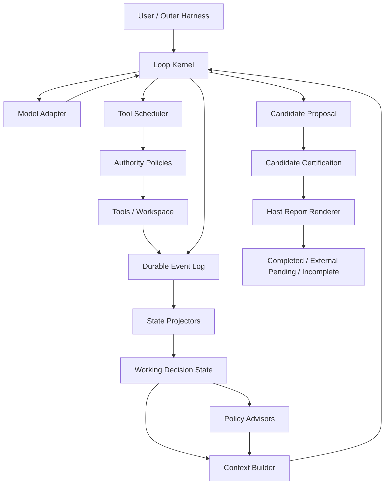
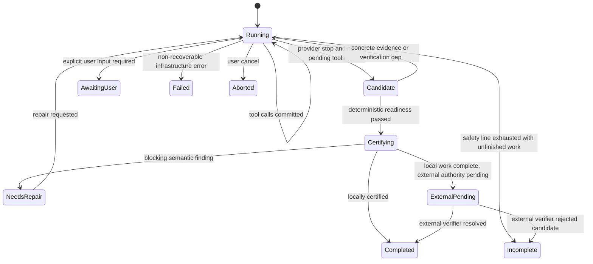

# Paw Coding Agent Loop Kernel v2 设计契约

> 状态：Frozen Design / 尚未启用
> 版本：`paw-loop-kernel-v2`
> 日期：2026-08-15
> Paw 审计基线：`ff2ec6e7a28391c6ef78efaf20297edaab0d6528`

## 1. 目的

本设计解决的不是某一道 SWE-bench 题，而是 Paw 当前两类相反的系统性失败：

- 产品代码已经正确，内部控制面仍拒绝完成；
- 内部控制面判定完成，本地测试也通过，但候选改变了错误的行为契约，官方验收失败。

v2 的目标是把当前“ReAct + 多个相互竞争的 gate”重构为：

1. 一个只负责可靠推进事件的薄 Loop Kernel；
2. 一个保存假设、证据、行为边界和验证状态的 Working Decision State；
3. 一组只能建议、不能越权接管模型动作的 Policy Advisor；
4. 一个与主解题循环分离、有界且可重放的 Candidate Certification 层。

本设计不承诺模型一定解对题。它承诺：模型获得必要证据的动作不会被粗粒度生命周期规则误杀；重复但无新信息的动作不会冒充进展；候选的完成、验证、评审、报告和外部评分不会混成一个布尔值。

## 2. 非目标

- 不针对 Django、SymPy、scikit-learn 或任何 benchmark ID 写特判。
- 不通过增加 prompt 篇幅或 reviewer 规则列表代替状态和接口设计。
- 不要求日常任务使用严格的固定轮次预算；成本/墙钟只作为用户可控安全线。
- 不把本地测试通过等价为语义正确，也不把外部待验等价为失败。
- 不一次性重写现有 orchestrator；v2 必须可在 v1 旁路 shadow、分片迁移和回退。
- 不在开发阶段消耗新的 untouched holdout；实现迭代只使用合成夹具和已 exposed 轨迹。

## 3. 设计依据

本设计同时依据 Paw 源码/真实轨迹和以下固定本地参考版本：

| 项目 | 固定 commit | 采用的通用原则 |
|---|---|---|
| Paw | `ff2ec6e7a28391c6ef78efaf20297edaab0d6528` | 事件持久化、checkpoint/resume、上下文归档、revision-scoped verification、external authority |
| DeepSeek Harness | `47f943859bef60e4160492346772ded9b24f765a` | loop/guard/tool scheduler 分层；repeat reminder 不 veto；parallel/exclusive barrier |
| OpenCode | `864889ab9f9e921c240930b1dcd2bc0d2352c555` | provider stop + 无未结工具自然终止；exact tool+input doom-loop；compaction 独立 |
| Pi | `46bb9a2c3bdb296b0d2179f7309ec6b79a7f3106` | 薄 agent loop；prepare/transform/stop 扩展点；顺序工具声明；结果按模型顺序提交 |

参考实现只证明某种机制可工程落地，不作为“照抄即可提高 benchmark 分数”的证据。

## 4. 核心不变量

### K1：Kernel 不做语义猜测

Kernel 只解释 provider 状态、结构化工具调用、取消、恢复、持久化和终止事件。它不根据“已经读了多少轮”“看起来该写代码了”判断某个只读工具是否合法。

### K2：只有 Authority Policy 可以 veto

下列策略可以拒绝动作：

- 用户审批与权限；
- filesystem/network/process sandbox；
- benchmark gold、外部路径和网络隔离；
- 并发写冲突、路径越界、危险副作用；
- schema/参数无效；
- 用户显式取消。

Convergence、进度、阶段、成本和 reviewer 均不能伪装成工具权限。它们只能：

- 注入建议；
- 降低某动作优先级；
- 记录无增量 cycle；
- 请求模型改变策略；
- 在安全线耗尽后诚实返回 `incomplete`。

### K3：工具成功不等于任务进展

`result.ok=true` 只表示工具协议成功。只有 Working Decision State 或权威产品状态发生有效 delta，才算 progress。

### K4：原始事实是事件，摘要是缓存

Durable event log、Mutation Journal 和 Verification Evidence 是事实源。Current State、compaction summary 和最终报告都必须可由事实重建，不能成为唯一事实副本。

### K5：候选、认证、交付是不同状态

模型停止意味着“提出候选”，不是“已经完成”。语义 review、验证 readiness、外部待验和最终报告各有独立字段，禁止再压成一个 `completed/tests_passed`。

### K6：每个 mutation revision 的语义评审有界

相同 `mutationRevision + candidateInputHash` 最多进行一次 semantic review。修改报告文案不能重新触发代码评审；只有源码 mutation、acceptance/invariant 的权威变化或新增实现证据改变 candidate input，才可生成新评审键。

### K7：策略修改不得静默丢动作

一个模型响应中的每个合法工具调用都必须进入 scheduler，或产生带原因的拒绝结果。`run_agent`、普通工具、控制工具混合时，不得因分支优先级静默忽略另一类调用。

## 5. 分层架构



### 5.1 Loop Kernel

职责仅包括：

- 读取 RunSpec 和 durable resume point；
- 组装已经由 Context Builder 生成的模型输入；
- 调用 Model Adapter；
- 将所有工具调用提交给 Tool Scheduler；
- 按模型顺序持久化 tool result；
- 将 provider stop/no-tool response 转为 Candidate Proposal；
- 处理 abort、timeout、cancel、provider error 和 terminal transition；
- 保证每个状态变化先落事件、再更新派生投影。

Kernel 不直接调用 constraint LLM、reviewer、compactor 或 memory；这些能力通过显式 hook/task 与事件交互。

### 5.2 State Projectors

Projector 从事件构建可丢弃、可重建的派生状态：

- Working Decision State；
- Tool/Read Coverage Index；
- Mutation Journal projection；
- Verification Matrix；
- Cost/latency/stall metrics；
- Candidate Certification state。

恢复时先加载最近 checkpoint，再重放后续事件。投影 schema 必须版本化，升级失败不得损坏原始事件。

### 5.3 Policy Advisors

Advisor 输入只读 state snapshot，输出结构化建议：

```ts
interface PolicyAdvice {
  readonly kind:
    | "repeat_observed"
    | "evidence_gap"
    | "hypothesis_stale"
    | "verification_due"
    | "candidate_ready"
    | "cost_warning";
  readonly priority: "info" | "warning" | "urgent";
  readonly evidenceRefs: readonly string[];
  readonly message: string;
}
```

Advisor 没有 `allowed: false` 返回值。真正的 Tool Authority 使用另一套类型和命名空间，避免生命周期策略再次越权。

## 6. Loop 状态机与终止语义



### 6.1 模型响应归一化

| Provider 结果 | Kernel 行为 |
|---|---|
| 一个或多个合法 tool calls | 全量进入 scheduler；不同时处理终止文本 |
| stop + 无 tool call + 有可见文本 | 生成 `candidate.proposed`；文本是候选说明，不是完成凭证 |
| stop + 无 tool call + 空文本 | 最多一次 provider/protocol recovery；再次为空则 `incomplete/empty_response` |
| length + 可能截断 tool args | 不执行这些调用；返回结构化截断错误并允许一次重发 |
| provider retryable error | 按 Model Adapter retry policy 重试，不丢当前 durable turn |
| provider terminal error | `failed/provider_error`，保留可恢复状态 |
| legacy `final_answer` | 兼容层映射为 `candidate.proposed`，不再拥有特殊完成权限 |

`ask_user` 和 `abort` 可继续作为明确控制动作；长期应迁移为 native control tools，避免从自由文本猜测。

Not-ready candidate 的反馈预算由 `(candidateInputHash, readiness gaps, readinessProgressKey)` 共同定界。`candidateInputHash` 继续只表示 mutation / verification / criterion 等可审查候选事实，保证同一代码候选不会因调查措辞或新增只读观察而重复 semantic review；`readinessProgressKey` 则必须从**最新 Working Decision State** 的唯一 evidence fingerprints 计算，不能从可能按 candidate identity 复用的持久化 candidate artifact 读取。新的 read/search 证据允许重新进入一次有界 repair cycle；只改 final prose、重复同一观察或没有新增事实时 key 不变，直接 `feedback_exhausted`。这条分离使 discovery 阶段可以继续推进，同时不放宽 certification 的 at-most-once 约束。

Candidate artifact 内的 readiness gap 文案属于可严格重放的持久化派生事实，运行时升级不得改写旧 schema 的文案，否则历史 artifact/resume 会因重算不一致失效。可执行 repair 指令属于 delivery 层：readiness gate 从 fresh projection 读取 current-revision `VerificationRecord`，在不改变 candidate assessment/hash 的前提下补充 `failureClass / argv / scope`。`untrusted_exit_status` 必须要求去掉 pipe/redirection/fallback/trailing command 后直接重跑；`code_failed` 必须声明当前 revision 的已观察失败不可由模型假定 hidden/external tests supersede。首次 repair 还必须明确要求实际发出 tool call，只有“接下来会做……”的 prose 不构成执行或 progress。

### 6.2 终局结果必须正交

```ts
interface RunOutcomeV2 {
  readonly executionStatus:
    | "completed"
    | "external_pending"
    | "incomplete"
    | "failed"
    | "aborted";
  readonly candidateStatus: "none" | "proposed" | "review_failed" | "certified";
  readonly localVerification:
    | "not_required"
    | "missing"
    | "passed"
    | "code_failed"
    | "harness_failed";
  readonly externalVerification: "not_configured" | "pending" | "resolved" | "rejected";
  readonly artifactStatus: "none" | "valid" | "invalid";
  readonly reasonCode: string;
}
```

这使“官方通过但 Paw 没收口”和“Paw 收口但官方失败”成为两项可独立计量的指标，不再靠 `status` 猜测。

## 7. Working Decision State v2

```ts
interface WorkingDecisionStateV2 {
  readonly schemaVersion: 2;
  readonly goal: {
    readonly verbatim: string;
    readonly sourceHash: string;
  };
  readonly phase:
    | "discover"
    | "hypothesize"
    | "implement"
    | "verify"
    | "repair"
    | "candidate";
  readonly criteria: readonly SemanticCriterion[];
  readonly hypotheses: readonly HypothesisRecord[];
  readonly evidence: readonly EvidenceRecord[];
  readonly invariants: readonly BehavioralInvariant[];
  readonly changeSurface: readonly ChangeSurfaceRecord[];
  readonly verification: readonly VerificationRecord[];
  readonly unresolvedRisks: readonly RiskRecord[];
  readonly currentMutationRevision: number;
  readonly currentCandidate?: CandidateRecord;
  readonly nextAction?: {
    readonly intent: string;
    readonly closesEvidenceGap?: string;
    readonly falsifiesHypothesis?: string;
  };
}
```

### 7.1 SemanticCriterion

Criterion 来自三种来源，并保留原文引用：

- `user_explicit`：用户或题面明确要求；
- `repository_contract`：现有测试、类型、公共 API、文档或调用方暴露；
- `external_test_id`：外部 verifier 拥有的测试 ID。

每项包含 `observable`、`authority`、`status`、`evidenceRefs` 和 `mutationRevision`。外部测试 ID 不能由模型标绿，但题面中的语义条件必须另外编译成 agent 可检查项，不能只留下外部名称。

### 7.2 HypothesisRecord

```ts
interface HypothesisRecord {
  readonly id: string;
  readonly statement: string;
  readonly status: "candidate" | "supported" | "rejected" | "superseded";
  readonly supports: readonly string[];
  readonly contradicts: readonly string[];
  readonly falsifier?: string;
  readonly proposedAtSeq: number;
  readonly closedAtSeq?: number;
}
```

进入实现阶段前至少要有一个 active hypothesis 和一个可证伪动作。对改变公共行为的候选，必须记录至少一个更小 change-surface 的替代假设；如果没有替代方案，需记录为什么不可能。

### 7.3 BehavioralInvariant 与 ChangeSurface

BehavioralInvariant 描述不能被无意改变的可观察行为，例如：

- 公共字段/返回值/异常类型与信息；
- 参数顺序、序列化精度、repr/字符串格式；
- side effect、文件范围、网络/数据库行为；
- backward compatibility 与题面明确 non-goal。

ChangeSurface 由 mutation journal 和静态边界投影生成，至少记录 changed file/symbol、公共或内部可见性、触及的字段/返回/异常，以及它关联的 criterion。reviewer 必须比较“题目点名的 observable surface”和“实际 change surface”。

### 7.4 状态写入权

- 文件、工具、mutation、test、diff、cost 等事实由 host projector 写；模型不能伪造。
- hypothesis、risk、next action 由模型通过版本化 `decision_update` 提议；host 校验引用存在、状态转换合法后落事件。
- criterion 的原文和 authority 由 trusted input/repository adapter 创建；模型只能补充 repository criterion，不能降级用户条件或 external authority。
- summary/compaction 只能引用 state id，不能直接改权威字段。

## 8. Evidence Novelty 与 Progress Delta

### 8.1 证据指纹

| 工具类别 | 规范化指纹 | 新颖度判断 |
|---|---|---|
| read file | normalized path + content hash + `[start,end)` | 新覆盖 span 或内容 revision 改变 |
| grep/search | root + normalized query/options + result hash | query 或结果集合发生实质变化 |
| symbol lookup | symbol identity + definition/call-site hash | 新 symbol、引用方向或代码 revision |
| shell diagnostic | normalized argv/cwd + output signature | 新 failure class、版本、环境事实或产品状态 |
| mutation | target + before/after hash + patch hash | material product mutation |
| verification | runner/scope/revision + outcome signature | 新 scope、更新 revision 或结果状态变化 |
| decision | hypothesis/criterion/risk transition | 合法状态迁移 |
| user | message hash | 新用户事实、授权或约束 |

### 8.2 ProgressDelta

```ts
interface ProgressDelta {
  readonly evidenceAdded: readonly string[];
  readonly hypothesesChanged: readonly string[];
  readonly criteriaChanged: readonly string[];
  readonly mutationsAdded: readonly string[];
  readonly verificationChanged: readonly string[];
  readonly risksChanged: readonly string[];
  readonly userStateChanged: boolean;
  readonly meaningful: boolean;
}
```

以下不算 progress：

- 完全相同的成功 read/grep/shell；
- 只改写模型说明或 final summary；
- 控制面 nudge；
- 同一失败命令换无关显示包装；
- 重新读取已覆盖 span 且文件 revision 未变；
- 只产生 cache/prune/compaction 事件。

### 8.3 Stall 处理

exact tool+canonical args 重复链在建议阈值 3/5/8 注入升级 reminder，但永不 veto。连续若干模型 cycle 没有 meaningful delta 时：

1. 首次要求指出当前假设、缺口和不同的可证伪动作；
2. 再次无 delta 时要求更换或拒绝当前假设；
3. 达到用户/产品配置的 stall safety line 后返回 `incomplete/stalled`，留下状态和建议，不假装完成。

阈值必须是版本化配置和观测指标，不得根据 benchmark 中途调参。

## 9. Tool Scheduler v2

每个工具或具体调用必须得到 host-side execution mode：

```ts
type ToolExecutionMode =
  | { readonly kind: "parallel" }
  | { readonly kind: "exclusive"; readonly scope?: readonly string[] };
```

规则：

- 只读且声明并发安全的调用可并行；
- write/edit/apply patch/shell/未知工具默认 exclusive；
- exclusive 等待之前的并行组排空，独占执行，并持有 barrier 直到 after-effect audit、事件提交和 projector 更新完成；
- 后续调用只能在 barrier 完成后开始；
- tool result 永远按模型原始 call order 写入上下文；
- 权限审批可串行，但不能改变调用顺序或丢弃未审批的结果占位；
- sub-agent 调用也进入同一 scheduler。read-only child 可并行；read-write child 依据声明的 workspace scope 建 barrier，未知 scope 按全 workspace exclusive；
- 一个 batch 中某调用被拒绝，其他不依赖它的调用仍按原顺序执行或得到明确取消原因。

## 10. Verification Evidence v2

优先提供 typed verification tool/adapter：

```ts
interface VerificationEvidenceV2 {
  readonly id: string;
  readonly runner: "pytest" | "unittest" | "bun_test" | "npm_test" | "custom";
  readonly argv: readonly string[];
  readonly cwd: string;
  readonly scope: readonly string[];
  readonly mutationRevision: number;
  readonly outcome: "passed" | "code_failed" | "harness_failed";
  readonly exitCode?: number;
  readonly assertions?: { passed?: number; failed?: number; total?: number };
  readonly failureClass?: string;
  readonly outputArtifactRef: string;
  readonly authoritative: boolean;
}
```

兼容期内 `workspace.run_shell` 仍可通过 parser adapter 生成 evidence，但 parser 结果必须带 confidence/source；低置信结果不能开启 completion gate。后来的 harness failure 不覆盖同 revision 已存在的 substantive pass；不同 scope 的 pass/fail 并存，由 readiness policy 明确需要哪些 scope。

## 11. Candidate Certification v2

### 11.1 Candidate Input

`candidateInputHash` 只由以下内容计算：

- 原始 goal hash；
- active semantic criteria/invariants；
- mutation journal/current patch hash；
- changed public surface；
- current-revision verification matrix；
- unresolved risk；
- reviewer 可读取的必要邻近代码 snapshot hash。

它不包含 proposed final prose，也不包含主 Agent 的隐藏 thinking/deliberation。

### 11.2 Deterministic Readiness

进入 semantic review 前由 host 检查：

- 必需 product mutation 是否存在；
- 所有 agent-owned criterion 是否有当前 revision 证据或明确 blocker；
- verification 是否满足任务 authority；
- final diff/mutation journal 是否完整；
- 是否仍有 blocking risk/finding；
- artifact 是否可重建。

这些检查不调用 LLM。

### 11.3 Semantic Reviewer

Reviewer 获得最小、去锚定输入，并返回结构化结果：

```ts
interface SemanticReviewV2 {
  readonly candidateInputHash: string;
  readonly mutationRevision: number;
  readonly verdict: "pass" | "fail" | "partial";
  readonly findings: readonly {
    readonly severity: "blocking" | "warning";
    readonly criterionId?: string;
    readonly invariantId?: string;
    readonly file?: string;
    readonly line?: number;
    readonly observedChange: string;
    readonly risk: string;
    readonly minimalAlternative?: string;
    readonly evidenceRefs: readonly string[];
  }[];
}
```

要求：

- 每个 blocking finding 必须绑定可见 diff/代码和 criterion/invariant；
- 不允许仅凭“可能有隐藏测试”判 fail；
- 必须检查命名行为边界与实际 change surface 是否一致；
- 公共状态扩大变更时必须比较最小替代方案；
- 相同 candidate input 只运行一次；reviewer 超时/协议错误得到 `partial`，不会无限重试；
- 主模型修复 blocking finding 后必须产生新的 mutation revision，才能再次评审。

### 11.4 Report Renderer

最终报告不再由 LLM reviewer 判真实性。Host 使用模板从事实源渲染：

- changed files/symbols 来自 mutation journal；
- tests/commands/outcomes 来自 verification ledger；
- diff inspection、external pending、环境限制来自 lifecycle state；
- 模型只可提供不带验证事实的用户说明和剩余风险描述。

若模型说明与 host 事实矛盾，host 删除/标注冲突并生成一次最终报告，不重新进入主循环，也不重新运行 semantic reviewer。

## 12. Context 与压缩契约

永不压缩或丢弃：

- 原始用户目标及 active constraints；
- active semantic criteria 和 behavioral invariants；
- active/rejected hypothesis 的状态与关键 evidence refs；
- current mutation journal/diff hash；
- current-revision verification matrix；
- unresolved blocking findings/risks；
- next falsifiable action；
- user approval、安全和 external authority。

可压缩：旧工具原文、旧模型说明、已关闭 hypothesis 的详细过程、已 superseded patch 和旧 revision 测试输出。压缩后保留 artifact ref，可按 id 精确 recall。

Context Builder 应输出稳定的分区，而不是每轮复制全部活动清单：

```text
[Task Contract]
[Decision State]
[Current Candidate]
[Verification Matrix]
[Unresolved Risks]
[Policy Advice]
[Recent Interaction Tail]
```

## 13. Mutation Journal 是主产物

每次成功 mutation 在工具返回后、下一模型轮前原子记录：

```ts
interface MutationJournalEntryV2 {
  readonly seq: number;
  readonly callId: string;
  readonly mutationRevision: number;
  readonly paths: readonly string[];
  readonly beforeHashes: Readonly<Record<string, string | null>>;
  readonly afterHashes: Readonly<Record<string, string | null>>;
  readonly beforeContentRefs: Readonly<Record<string, string | null>>;
  readonly afterContentRefs: Readonly<Record<string, string | null>>;
  readonly patch: string;
  readonly workspaceEffect: "product" | "test" | "control" | "unknown";
}
```

`patch` 必须是本次 mutation 的完整、未截断 delta，不能复用 UI/tool-result 中为展示而截到 2048 字符的 diff。`beforeContentRefs/afterContentRefs` 指向 host 在 exclusive barrier 内保存的不可变原始内容；文件不存在用 `null`，内容引用解析出的 bytes 必须与同路径 hash 一致。未知写路径的 shell/sub-agent 只有在 after-effect audit 枚举并捕获全部实际变化后才能形成可重建 journal，否则候选 artifact 为 invalid，不能因工具返回 `ok` 猜测完整。

最终标准 unified diff 不通过串接多个 step delta 产生：对每个路径取 journal 中最早的 before content 与最后的 after content，验证中间相邻 revision 的 after hash 等于下一次 before hash，再由纯 materializer 生成一次 baseline→terminal diff。这样同一文件多次编辑、新建、删除和回改都只产生一个可应用的最终文件 patch。Git diff 仅用于检测 journal 漏记、外部写入或基线漂移；Git 超时不能把已有 journal 候选变为空 patch，但 cross-check 不一致必须标记 artifact invalid，不能静默接受。

### 13.1 2026-08-15 实现前证据修订

只读审计现有 Paw 路径确认，`packages/workspace/src/files/write.ts` 的 `computeDiffStats()` 对 write/edit diff 固定 `.slice(0, 2048)`；`apply_patch` 的完整输入虽在 tool call 中，但它是相对于当时 workspace 的单步 delta；checkpoint 只保存 mutation 前文件，`run_shell` 仅存 shell metadata。旧 SWE recovery 因此只敢重放 exact `edit_file`，遇到 write/apply_patch/notebook/sub-agent/shell 就拒绝自动恢复。这证明原先只列 `beforeHashes/afterHashes/patch` 的接口不足以兑现 R14 的“Git 不是产物单点”，不是实现便利问题。

因此 schema 在尚未进入 v2-shadow、没有生产 v2 event log 的阶段补充 content refs，并把“full step delta + immutable before/after contents + continuity check”冻结为 artifact invariant。content blob 可由外围 artifact store 保存，kernel/projector 只持引用与 hash；模型上下文不自动注入全文。该修订不授权读取 benchmark gold/test patch，也不允许为特定题选择恢复路径。

## 14. 兼容与迁移

### 14.1 Feature flag

实现期间保留显式版本：

```text
PAW_LOOP_KERNEL_VERSION=v1|v2-shadow|v2
```

- `v1`：当前行为不变；
- `v2-shadow`：v1 执行动作，v2 只重放事件并产出 decision/progress/candidate 差异，不影响工具准入和终局；
- `v2`：新 kernel 权威执行。

禁止根据 benchmark task 自动选择版本。

### 14.2 分阶段替换

1. 先实现 versioned event/projector 和 replay CLI，不改变行为；
2. 接入 evidence novelty/progress shadow metrics；
3. 替换 tool scheduler，保持模型协议与完成门不变；
4. 引入 natural-stop candidate 兼容层和 host report；
5. 引入 Working Decision State/semantic criteria/reviewer v2；
6. v2 deterministic readiness 全绿后，删除 convergence 的非安全 veto；
7. 开发集 A/B 稳定后才默认启用 v2；v1 至少保留一个发布周期供回退。

每个切片独立提交，必须同时包含不变量测试和本日志记录。

## 15. Deterministic Failure-Replay 测试矩阵

所有 replay 默认不调用模型、不联网、不读 benchmark gold/test patch。真实轨迹只提取已 exposed 的最小事件、题面、候选 diff 和必要源码快照；expected outcome 来自冻结事实，而不是运行时查询答案。

| ID | 来源 | 最小输入 | 必须证明 | 失败保护 |
|---|---|---|---|---|
| R01 | v10 Django 15738 | 同文件已覆盖 span + offset 1189 新 span | 新 span 产生 evidence delta，advisor 不得 veto | 相同 path 不能一律视为重复 |
| R02 | 合成 | 三次完全相同 read + 相同内容 hash | 首次有 delta，后两次无 delta；3 次只注入 reminder | `ok=true` 不重置 stall |
| R03 | 合成 | 相同 grep 参数但文件 revision 改变 | 新结果 hash 重新算 evidence | 不把修改后的重查误判重复 |
| R04 | v11 Django 14155 | 原题面 + 旧候选 diff +公共字段快照 | change-surface 检查标出 `__init__` 改变 `func/args/kwargs`，要求比较只改 repr 的更小方案 | reviewer 不继承实现建议锚点 |
| R05 | v11 Django 14155 | 同 mutation、六个不同 summary | semantic reviewer 调用次数恰为 1 | summary fingerprint 不再重置代码 review |
| R06 | v11 Django 14155 | 实现 pass、报告含未记账 manual check | host 删除/标注不支持事实并一次交付 | report correction 不回主循环、不调 reviewer |
| R07 | v7 SymPy/scikit 官方通过内部失败簇 | typed pass + 后续 harness failure | substantive pass 保留；outcome 分离为 candidate/verification/artifact/external | 后来的环境错不抹旧绿测 |
| R08 | v9/v11 内部完成官方失败簇 | internal certified + external rejected | 结果保存为两个正交字段，统计为 semantic false positive | 不用 `completed` 冒充 resolved |
| R09 | 合成 scheduler | read A、edit B、read B、test | read A 可先行；edit exclusive；后续 read/test 等 barrier；结果按 call order | 禁止 read/edit/test 盲目 Promise.all |
| R10 | 合成 mixed calls | read-only sub-agent + normal grep + exclusive edit | 三个调用均执行或明确拒绝，无调用消失 | `run_agent` 分支不得吞普通工具 |
| R11 | 合成 provider stop | 工具后自然文本 stop，无 `final_answer` | 形成 Candidate Proposal 并进入 readiness | 不再协议恢复到 max steps |
| R12 | 合成 empty response | 连续两次 stop+empty | 一次 recovery 后 `incomplete/empty_response` | no-action nudge 有硬界限 |
| R13 | 压缩夹具 | active hypothesis、rejected hypothesis、current test、旧大工具输出 | 压缩后关键 decision/verification hash 不变，旧原文可 recall | 摘要不能擦除决策状态 |
| R14 | Git timeout 夹具 | 两次 mutation journal + `git diff` 超时 | 仍生成完整候选 patch并记录 cross-check error | Git 不是产物单点 |
| R15 | resume 夹具 | checkpoint + 后续 event + journal | projector 重建 hash、seq、revision 与中断前一致 | resume 不重复 mutation/review |
| R16 | external authority | local harness unavailable + valid journal/diff + external configured | `external_pending`，报告不得声称通过 | 环境失败既不假成功也不误判代码错 |
| R17 | criterion staleness | criterion 在 r1 满足，r2 mutation | r1 证据变 stale，需 r2 evidence 或 blocker | 旧验收不能覆盖新代码 |
| R18 | reviewer protocol | reviewer timeout/无结构化 verdict | 相同 candidate 记录一次 partial 并有界退出/交接 | reviewer 不能成为无限重试单点 |
| R19 | Django 15098 post-N4Q | natural-stop 叙述 → readiness blocked → 新 read → natural-stop 叙述 | 新 evidence 后重开一次 repair；随后 edit/test/final 可完成 | candidate artifact 复用不得冻结 discovery progress；重复 prose/read 不得重置 |
| R20 | Django 15098 post-N4V | masked `runtests.py ... \| tail` VerificationRecord + 历史 candidate artifact | repair 显示 failureClass/argv/scope、要求 direct rerun；旧 artifact 仍可严格解析 | runtime guidance 不得改写持久化 assessment；模型不得用 prose 或 hidden-test 猜测豁免失败 |

### 15.1 Replay 产物

每个 fixture 固定输出：

- input event hash；
- projected Working Decision State hash；
- ProgressDelta 序列；
- policy advice 与 authority decision；
- scheduler start/commit order；
- candidate/review/report 调用计数；
- RunOutcomeV2；
- mutation patch hash。

测试不得只断言 prompt 包含某句话；必须断言状态、事件、调用次数、顺序和终局字段。

### 15.2 现有回归兼容

迁移时至少保留并重写下列现有能力的等价断言：

- checkpoint/resume、event seq、abort；
- mutation revision 与 stale verification；
- external authority 与 honest incomplete；
- tool approval、sandbox、file lock、effect audit；
- compaction 后 acceptance/constraints 存活；
- truncated native tool args 不执行；
- exact repeat reminder；
- artifact replay 与 integrity scan。

旧测试中“没有 `final_answer` 必须 incomplete”“任一成功工具清零 stall”“convergence 可以拒绝只读工具”“summary 改变可以再次 semantic review”等断言属于 v1 行为，v2 测试不得机械继承。

## 16. 开发集、Holdout 与完成标准

### 16.1 开发阶段

- 使用 R01–R20 合成/冻结 replay；
- 使用已 exposed 的 fresh-v2、v7–v11 轨迹做离线 shadow；
- 必要的真实模型 A/B 只在已 exposed 开发题运行；
- 比较 resolved、inner close correctness、tool/model calls、token、wall time、stall、review count 和 artifact validity；
- 架构修改必须先改变对应 replay，再观察开发集，不因单次采样覆盖结论。

### 16.2 冻结前 Gate

Loop Kernel v2 只有同时满足以下条件才可冻结：

1. R01–R20 全部通过；
2. Agent/core 相关回归无产品断言失败；
3. v2-shadow 对已通过轨迹不引入 artifact/verification 回退；
4. 两类错判可被独立统计，不能再出现字段歧义；
5. 同 candidate review ≤1、report correction ≤1；
6. 非安全生命周期策略的 tool veto 数量为 0；
7. mixed tool batch 调用丢失数量为 0；
8. Git 故障下注入 patch 可恢复且 mismatch fail closed。

### 16.3 最终 Holdout

上述 gate 全绿后，从 clean commit 冻结最后一组 untouched 公共题：

- 题目、模型、effort、工具、sandbox、memory mode、外部 verifier 和安全线全部版本化；
- 整批运行期间不修改 Paw 架构、不替换题、不重采样失败；
- 首先证明 Paw 自身达到冻结通过线，再启动同模型 Claude Code 对比；
- 公开结论同时报告 official resolved、内部收口混淆矩阵、artifact/integrity、成本和时延；
- 若整批失败，先冻结完整结果，后续优化进入新的开发版本，不改写本批成绩。

## 17. 实施顺序

建议按以下独立提交推进：

1. `v2-events-projector`：schema、event、projector、replay CLI 与 R01–R03/R13/R15；
2. `v2-progress-advisor`：evidence novelty、progress delta、bounded stall，移除 `ok=true` 进度语义；
3. `v2-tool-scheduler`：parallel/exclusive barrier 与 R09/R10；
4. `v2-candidate-terminal`：natural stop、bounded empty recovery、legacy final compatibility 与 R11/R12；
5. `v2-certification`：semantic criteria/change surface、review key、host report 与 R04–R08/R17/R18；
6. `v2-verification-artifact`：typed evidence、mutation journal primary、Git cross-check 与 R07/R14/R16；
7. `v2-shadow-ab`：全量已有回归、exposed 开发集、指标比较；
8. `v2-default`：删除非安全 veto，冻结产品版本和最终 holdout 协议。

每一步必须记录：完成内容、设计不变量、测试、遇到的问题、解决方式、已知限制、commit 和下一步。任何实现如果需要违反本设计的不变量，必须先在独立设计提交中说明新证据并修改版本，不能在代码里静默偏离。
