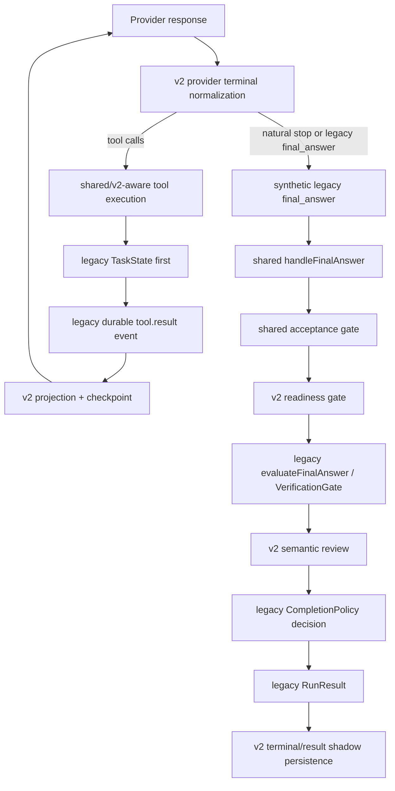
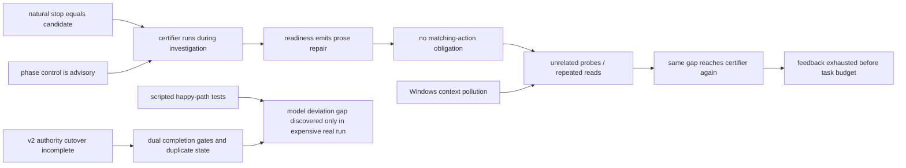

# Paw Agent Loop 架构审计（2026-08-16）

## 0. 审计边界

本次按用户要求暂停 benchmark 做题、同题复跑和产品代码优化，只审计 Paw 当前 agent loop。证据来自：

- 当前 `main@25fac5a` 的生产代码；
- 最近一次真实 Paw 运行 `paw-django__django-15098-msuk890a` 的 AppState、JSONL 事件和终局；
- 本地参考仓库 `pi`、`deepseek-harness`、`opencode`、`claude-code` 的 loop/tool settlement 实现；
- 已有 deterministic/production trajectory 测试。

本报告不把某一道 Django 题的解法当成架构结论，也不以“增加回合数”或“多写一条提示词”代替根因分析。本步没有修改 Paw 产品代码。

## 1. 白话结论

Paw 现在的问题不只是“架构太复杂”，而是**新旧架构的权威切换没有完成**：

1. v2 已经接管 provider stop 归一化、候选证据投影、readiness 和 semantic review；
2. 旧 loop 的部分行为护栏在 v2 下确实关闭了，因此它们不是最近一次无 edit 的直接 blocker；
3. 但自然停止仍被 v2 合成为旧 `final_answer`，然后进入共享的旧 `handleFinalAnswer()`；
4. v2 readiness 通过后仍运行旧 VerificationGate，最终 `RunResult` 仍由旧 `TaskState + CompletionPolicy` 生成；
5. v2 terminal 又把这个旧结果持久化成 shadow/映射 artifact，且该持久化失败会被吞掉；
6. 长任务推进目前主要依靠 advisory 文案，没有可持久化、可约束的“当前阶段、当前假设、下一项必须完成的动作”；
7. readiness 发现问题后只发提示，没有建立 `repair obligation -> matching committed action`。模型可以理解提示，却用无关探针代替指定动作；
8. Windows 路径未统一，真实运行把大量 `__pycache__/.pyc` 当成外部修改反复注入上下文，进一步稀释注意力。

因此，Paw 的核心故障模式是：**turn 结束被误当成完成意图 → 完成认证器被迫充当调查阶段控制器 → 只给建议、不约束下一动作 → 模型继续旁路调查 → 相同候选再次触发认证 → readiness 提前熔断**。

最近一次失败不是因为 96 回合预算不够，也不是百万上下文已满。它在第 25 回合主动以 `loop_v2_readiness_feedback_exhausted` 结束，当时尚余 71 回合，历史上下文约 83.8K / 730K tokens，`truncationCount=0`。

## 2. 当前真实生产链路

这不是两套完整 loop 同时各自调用模型，而是**v2 内核嵌在旧生命周期外壳中**。风险来自同一决定经过多套状态和门禁，而不是单纯存在旧文件。

## 3. 旧 loop 到底还有哪些作用

| 决策面 | v2 当前实际权威 | 旧逻辑状态 | 审计结论 |
|---|---|---|---|
| Provider 响应/stop | `normalizeProviderResponseV2()` | 旧 `final_answer` 仍是兼容输入 | v2 已接管入口 |
| 工具执行 | v2-aware scheduler/commit seam | `TaskState.recordToolResult()` 与 legacy event 仍先提交 | 混合提交路径 |
| Coding-phase 导航 hard block | 无，v2 为 advisory | `legacyBehaviorGuards=false` | 已关闭，不是本轮 blocker |
| Convergence tool block | 无，v2 为 advisory | 仅 guidance 仍注入 | hard block 已关闭 |
| Idle-fuse hard stop | v2 下关闭 | 旧 flag 仍存在 | 不掌权但有状态残留 |
| Plan/Todo completion veto | v2 下 `projection_only` | bootstrap plan 仍可投影标绿 | veto 已关闭 |
| Acceptance criteria | 共享 gate | 继续参与 | 合理的共享安全/合同门 |
| Candidate readiness | v2 | 无对应旧 gate | v2 掌权 |
| Verification completion gate | v2 readiness 后仍调用旧 `evaluateFinalAnswer()` | 旧 `verifyNudges` 仍有效 | 明确双门控 |
| Semantic review | 配置 v2 reviewer 时旧 reviewer 跳过 | fallback 保留 | v2 基本掌权 |
| 最终 completion decision | `CompletionPolicy` | 旧 `TaskState` 提供输入 | 旧生命周期仍掌最终 RunResult |
| v2 terminal artifact | 映射 legacy RunResult | 异常被吞并继续返回 legacy 结果 | 尚非终局权威 |

代码证据：

- `packages/agent/src/loop-authority.ts` 将 v2 behavior 设为 `advisory_only`、planning 设为 `projection_only`，但 completion 仍统一声明 `completion_policy_only`；
- `packages/agent/src/orchestrator.ts:2301-2367` 把 natural stop 转成 synthetic `final_answer`；
- `packages/agent/src/orchestrator/action-handlers.ts:646-799` 的顺序为 acceptance → v2 readiness → 旧 `evaluateFinalAnswer()` → v2 semantic review → 返回旧 decision；
- `packages/agent/src/orchestrator.ts:1148-1232` 明确把 `state.decision` 通过旧 lifecycle 映射为 `RunResult`；
- `packages/agent/src/orchestrator.ts:854-859` 吞掉 `persistLoopV2Terminal` 异常，注释仍写着“until the authority cutover”。

## 4. 分级发现

### P0-A：完成权威切换未完成，readiness 后仍有旧 VerificationGate

这是已证实问题，不是代码命名猜测。

`handleFinalAnswer()` 先要求 v2 readiness ready，然后再次调用旧 `evaluateFinalAnswer()` 和最多两次 `verifyNudges`，最后仍返回 `evaluated.decision`。这会导致：

- 同一 verification fact 由两套规则解释；
- 两套 retry budget 可以互相影响；
- v2 artifact 宣称的完成原因与外部返回结果必须再做映射比较；
- 新机制修改时很难判断应改 readiness、VerificationGate 还是 CompletionPolicy。

需要保留的不是“旧代码”本身，而是共享的 job settlement、acceptance 和最终状态映射；需要消除的是同一 verification/completion 决策的双重所有权。

### P0-B：`natural_stop` 被等同于“提交候选”，混淆 turn 结束与完成意图

`provider-terminal.ts:128-137` 规定：没有 tool call、存在可见文本且 finish reason 为 stop，就产生 `candidate_proposed`。生产路径随后合成 `final_answer`。

真实运行直接证明该语义与 DeepSeek 行为不匹配：

- 模型输出 `Let me probe the exact runtests environment properly...`，被记录为 `final_answer`；
- 模型输出 `Now let me read the CountrySpecificLanguageTests...`，再次被记录为 `final_answer`；
- 模型输出 `Let me read the tests that constrain...`，第三次成为 `final_answer`。

这些文本是未来动作叙述，不是完成报告。问题不应通过 `Let me/下一步` 等语言正则修复；更稳健的边界是：**provider stop 只表示一个 turn 结束，只有满足当前可执行状态的 stop 才能进入 candidate certification；not-ready stop 应进入下一 turn 控制，而不是先伪装成 final_answer。**

### P0-C：repair feedback 只有建议，没有 durable obligation

N4X 已把 `untrusted_exit_status` 的 verification id、runner argv、scope 和 direct no-pipe 指令准确送给模型。真实 trace 中模型也明确说：

> re-run the baseline test without any pipes so the exit status is trustworthy

但下一动作不是直接运行 `tests/runtests.py`，而是自建 `python -c` 探针；随后继续读测试。说明信息传达成功，但控制契约失败。

当前 readiness key 只看 candidate、gap 与唯一 evidence fingerprints。新 read/search 可以重开一次 repair，但它度量的是“观察有新内容”，不是“缺口被关闭”。任何成功工具还会重置旧 `verifyNudges/idleFuse` 等 stall budget。系统缺少：

- obligation 的类型（direct verification、mutation、targeted evidence）；
- obligation 绑定的 runner family/scope/revision；
- 哪类 committed tool result 能履约；
- 哪类动作只能作为失败/诊断，不能解除 obligation；
- resume 后 obligation 的完整恢复。

结果是模型能用无关成功动作绕开“下一步必须做什么”的意图，随后在 gap 未关闭时被认证器熔断。

### P1-A：状态与持久化存在多重真相，resume 不能精确恢复控制状态

当前至少同时存在：

- AppState 的 messages/plan/todos/`TaskState`；
- append-only legacy session events；
- v2 `WorkingDecisionState` projection checkpoint；
- candidate、review、terminal、RunResult shadow artifacts；
- 只在内存跨轮传递的 `TurnFlags`。

`AppState` 不保存 `TurnFlags`。resume 时绝大多数 flag 重置：`hasEverUsedTools=false`、`autoContinueNudges=0`、verification/idle/coding/repeat-tool 状态都丢失；只有 readiness/semantic feedback 通过扫描历史 user message 的 marker 文本恢复。provider terminal 也只按 `lastTurn` 重建，而不是完整恢复。

这意味着控制状态被编码在展示文本中，且 crash/resume 前后 CompletionPolicy 输入可能不同。marker 解析可以避免同一 readiness 再开一次，但不是通用的 durable state machine。

### P1-B：工具提交跨 legacy/v2 存储不原子

`commitToolExecutionResult()` 的顺序是：

1. 修改 legacy `TaskState`；
2. 发出并持久化 legacy `tool.result` event；
3. 调用 v2 projection；
4. 写 v2 checkpoint；
5. 最后保存 AppState。

显式 v2 在 projection/checkpoint 失败时会 fail-closed，这是正确方向；但失败发生前 legacy state/event 已经提交。resume 还允许损坏的 optional legacy event log 被忽略并开启新 segment。当前有冲突校验，但没有一个事务边界保证所有视图同时提交或都不提交。

这是结构性 split-brain 风险；本次真实失败未观测到 checkpoint 损坏，因此应记录为“代码确定、生产触发尚未证实”，不能夸大为本轮直接根因。

### P1-C：长任务没有可执行的调查→实现→验证状态机

v2 关闭旧 coding-phase hard block 后，剩下的推进机制主要是提示词：

- `statusPaceV1()` 在任意一次 read/command 后、尚无 mutation 时立即把 pace 从 `investigate` 切为 `implement`；
- Status Snapshot 自己声明 `authority=advisory_only`；
- `implementationGuidance()` 直到 `ceil(maxSteps * 0.5)` 才注入；96 回合配置下是第 48 回合；
- 最近真实 run 在第 25 回合已被 readiness 熔断，根本到不了第 48 回合；
- 状态中没有“当前假设是否成立、还缺哪一条证据、下一动作为什么能缩小不确定性”。

所以模型看到“应该实现”并不等于系统能阻止继续宽泛调查。readiness 被迫在每次自然停止时兼任中途控制器，职责层次错位。

### P1-D：Windows watcher 路径不一致，真实污染上下文

`WorkspaceWatcher` 把 `fs.watch()` 返回的原始路径直接存进 `changedFiles`，但 `markAgentWritten()` 转为 `/`；orchestrator 的 ignore filter 也只检查 `/__pycache__/` 形式。Windows 返回 `\`，因此：

- `__pycache__/.pyc` 过滤失效；
- agent 自写路径与 watcher 路径可能无法匹配；
- 生成文件被当成“用户在外部修改”，以 user message 注入模型。

最近真实 AppState 有 41 条消息、103,567 字符，其中 8 条外部修改警告共 8,655 字符（约 8.4%）。样例一次列出约 31 个路径，主体是 Python bytecode。它不是唯一失败原因，但属于已证实的生产 context contamination。

### P1-E：候选 artifact 将事实、派生评估和展示文案绑在同一严格 hash 中

semantic `candidateInputHash` 本身正确排除了最终 prose；但 persisted live artifact 的 `artifactHash` 覆盖完整 report + assessment，assessment 又含 readiness gap message。parser 会用当前代码重算 assessment 和 artifact hash。

N4X 早期方案仅增强 gap 文案，就使旧 N4W artifact 无法按新代码严格解析。最终只能把 actionable 解释放到 delivery 层，避免改 persisted wording。这说明展示文案已经成为历史 artifact 的隐式 schema，妨碍兼容演进。

此外，candidate artifact 可以因 candidateInputHash 相同而复用旧 assessment；R19 又必须从 fresh projection 单独计算 evidence progress。语义候选、操作进度与展示报告目前混在同一 artifact 族中，边界不够清晰。

### P1-F：核心 orchestrator 是高耦合 god object

规模取证：

- `orchestrator.ts`：4,621 行、约 102 个 private methods；
- `action-handlers.ts`：1,901 行；
- `tool-runner.ts`：1,412 行；
- `task-state.ts`：1,134 行；
- `loop-v2/`：28 个 TypeScript 文件、7,495 行。

`AgentOrchestrator` 同时负责记忆、上下文、约束、压缩、模型调用、provider 解析、工具、checkpoint、恢复、状态快照、candidate 持久化、review、terminal、MCP 和 subagent。复杂度本身不是 bug；真正风险是这些职责共享 `TurnFlags`、`TaskState`、ContextManager 和 emit side effects，导致一次“修复 readiness 文案”也可能触发 artifact、resume、CompletionPolicy 或旧 gate 兼容问题。

### P1-G：现有 trajectory 测试证明理想脚本，不证明模型偏航后的恢复能力

R19 production trajectory 使用精确脚本：

`read → narration stop → new read → narration stop → edit → test → final`

它能证明 plumbing 正常，却预先保证模型在收到下一次机会后选择正确 edit/test。真实模型走的是：

`masked test → feedback → unrelated probes → repeated read → narration stop`

目前缺少以下 adversarial trajectory：

- 收到 direct verification obligation 后先调用错误工具；
- 调用同类但 scope/runner 不匹配的验证；
- 无关成功命令不能清除 obligation；
- 重复 read/换句话不能算 gap closure；
- crash/resume 后 obligation、budget、provider cursor 全部一致；
- candidate artifact wording升级仍能读旧 schema。

另外，多个 integration test 在 Windows 负载下会碰默认 5 秒 timeout。放宽测试进程上限后断言通过，说明主要是测试基础设施噪声，但它会降低 CI 对真实竞态/性能退化的辨别能力。

### P2-A：能力裁剪仍是 shadow，模型每轮看到完整 30 个工具

真实 inventory：30 个工具、3,134 tokens；shadow 建议 20 个、2,219 tokens，估计每轮可少 915 tokens。但 `mode=shadow`，实际仍暴露 30 个。25 次模型调用仅工具定义理论重复成本就多约 22,875 tokens。

这不是最近失败的主因，也不能在没有 ablation 前宣称“工具多导致不会做题”；但它说明 Paw 已计算出阶段工具集，却尚未用于真实控制面。工具、plan/todo、memory、subagent 等通用说明一起进入 system prompt，会增加选择空间和提示冲突概率。

### P2-B：可观测性很多，但“谁是真相”仍不直观

Paw 的事件、artifact、integrity、candidate 和 verification 记录比多数轻量 agent 丰富，这是优点。但生产代码仍大量使用 `legacy`、`shadow`、`dual calculation until cutover` 等迁移语义；TUI/runner 终局首先返回 legacy RunResult，v2 artifact 再解释它。真实长跑中也缺少简洁的“当前 obligation/phase/why blocked”视图，排障只能同时读 AppState、JSONL 和多个 artifact。

## 5. 最近真实运行能排除什么

| 假设 | 结论 | 证据 |
|---|---|---|
| 只是 maxSteps 太严格 | 排除 | 25/96 回合即 readiness 熔断 |
| 百万上下文已经塞满 | 排除 | history 83,759 / 730,000，0 次 truncation |
| 旧 coding phase 阻止 edit | 排除 | v2 `legacyBehaviorGuards=false` |
| verification classifier 不会识别 pipe | 排除 | 正确记录 `untrusted_exit_status` |
| repair 文案模型没看懂 | 排除 | 模型明确复述 no-pipe/direct status 意图 |
| scorer 或 patch collector 误判 | 排除于本次终局 | 没有 product mutation，候选本来就不可评分 |
| 只有模型能力问题 | 不能成立 | 模型理解 obligation，但 runtime 没把理解变成动作约束 |
| 架构完全不可用 | 不能成立 | provider、工具、证据分类、artifact integrity 均有有效部分 |

真实 trace 总计 25 model calls、32 tool calls（17 read_file、6 shell、5 grep、2 glob、1 recall、1 git_log），prompt 1,487,933 + completion 79,601 = 1,567,534 tokens。高成本主要来自多轮重复大上下文与调查，不是单次窗口溢出。

## 6. 与本地优秀 agent 的对照

### Pi

`pi/packages/agent/src/agent-loop.ts` 的核心循环很小：assistant turn → tool calls → 按序追加 `toolResult` → `prepareNextTurn`/`shouldStopAfterTurn` → 下一轮。截断或被阻止的 tool call 会生成 `isError=true` 的模型可见 tool result，loop 继续，让模型重新发起调用。

可借鉴点不是“照抄简单 loop”，而是：**turn boundary、tool settlement、下一轮控制是明确 seam；拒绝也是正式 tool result，不另起一套隐藏 retry 状态。**

### DeepSeek Harness

`deepseek-harness/packages/core/agent-loop` 以 durable session events 记录 `turn/start`、`step/start/end`、`tool/call`、`tool/result`；scheduler 即使 pre-execute deny/throw，也按模型顺序持久化 error result。`agent/turn-stopping` 是 stop 前的扩展 seam，插件可在同一 durable loop 中注入下一步消息。

可借鉴点是：**一个 append-only session 是主要事实源，policy denial 在 tool settlement 边界落地，停止前有单一控制 seam。** 这正适合承载 Paw 的 repair obligation，而不是在 final-answer gate 后追加更多 prompt flag。

### OpenCode

OpenCode 将 session processor 的 `stop/compact/continue` 与 durable message/tool parts 分开；其 v2 tool spec 明确把 unknown/invalid/stale 调用结算为模型可见错误，且区分 tool failure、interruption 和 runner defect。

可借鉴点是：**失败分类与持久化 settlement 绑定，展示层/输出裁剪不冒充 domain result。** Paw 已有较好的 verification 分类，但 obligation 尚未进入同样的 settlement 语义。

### Claude Code 克隆源码

本地 `claude-code/src/QueryEngine.ts` 主要依据 assistant/user result、provider stop reason 和 permission denials 收口，没有发现可直接移植的复杂 readiness 状态机。它证明参考项目的共同方向不是“堆更多完成 gate”，而是让 provider/tool/result 生命周期稳定、可恢复，再在明确 seam 上扩展策略。

## 7. 根因图

## 8. 不建议做的“快速修复”

以下做法会掩盖问题，不应作为下一步：

- 把 readiness retry 从 1 改成更大；
- 再添加一段“请马上执行，不要叙述”的提示词；
- 用 `Let me/我要/下一步` 等语言启发式判断是不是 final；
- 为当前 Django 题硬编码 runner command、文件或测试名；
- 恢复旧 coding-phase 的固定导航次数 hard block；
- 直接删除所有 legacy 代码，连 job settlement/acceptance/RunResult 映射一起破坏；
- 继续开新题，用更多 benchmark 样本替代架构收敛；
- 仅靠增加 context window 或总回合数。

## 9. 建议的后续架构顺序（本次未实施）

1. **冻结 authority cutover matrix。** 每个决定只能有一个 owner：provider boundary、tool settlement、evidence、readiness、semantic review、completion、terminal persistence。
2. **把 natural stop 降级为 turn boundary。** not-ready 时由 phase/obligation controller 决定下一轮；ready 时才创建 candidate。不要猜文本意图。
3. **在 tool pre-execute/settlement seam 建 durable repair obligation。** 绑定 revision、gap、动作类别、runner family/scope；只有匹配且 committed 的结果才能履约或改变 obligation。
4. **让 completion 只走一套 verification/readiness。** v2 ready 后不再二次经过旧 VerificationGate；CompletionPolicy 只负责统一映射状态，不重新解释证据。
5. **统一 durable truth。** 选择一个 append-only event ledger；TaskState 和 WorkingDecisionState 变成可重放 projection，不能各自先写。TurnFlags 中影响行为的字段进入结构化 durable control state。
6. **先修 watcher 路径入口归一化。** 所有路径进入 Set 前统一 `/`、大小写/relative policy，再做 ignore/internal-write 匹配。
7. **把长任务阶段变成状态，不是文案。** 记录 active hypothesis、missing evidence、next action、phase transition reason；不采用死板总 token 预算，但要求每阶段有可观察里程碑。
8. **再做 capability exposure。** 用 ablation 证明 20-tool 实际裁剪是否提升成功率/成本，不能仅凭 token savings 上线。
9. **补 adversarial loop fixtures。** 先覆盖 wrong action、unrelated success、resume、artifact schema evolution，再进行同题真实回归。
10. **最后拆 orchestrator。** 先稳定 authority 和事件合同，再按 provider loop、tool runtime、control state、candidate certification、terminal mapper 拆模块，避免只移动文件不减少耦合。

## 10. 架构整改何时算完成

在重新大规模做题前，至少应满足：

- 一张 authority matrix 与生产代码一致，无 verification/completion 双 owner；
- natural stop 在调查阶段不会制造 synthetic final candidate；
- repair obligation 可持久化、可重放，错误工具/无关成功/纯 prose 均不能解除；
- crash/resume 前后相同事件得到相同 phase、obligation、candidate 和终局；
- tool result 的 legacy/v2 视图不会部分提交；
- 旧 candidate artifact 能跨文案/派生评估升级读取，或有明确 schema migration；
- Windows watcher 不再注入 bytecode/build 噪声；
- adversarial deterministic trajectories 全绿；
- 同一固定复杂题能自然完成 mutation → direct verification → diff inspection → candidate，不靠 task-specific hint；
- 之后才恢复固定十题，并以 official resolved、完整 trace、成本和停止质量判断是否进入 Claude Code 配对比较。

## 11. 本次审计最终判断

Paw 不是“功能太多所以必然做不好”，也不是应推倒重写。它已有可信工具执行、verification 分类、artifact integrity、sandbox 和丰富观测能力。当前真正阻碍商业级长任务能力的是：

> **执行内核的权威边界尚未收敛，完成认证被提前用于中途控制，而控制反馈没有转化为可执行、可恢复的状态约束。**

下一步如果开始优化，应先修 authority/obligation/turn-boundary 三件事，再碰 prompt、预算或更多 benchmark；否则继续加机制只会让旧问题在更复杂的状态组合中重现。
