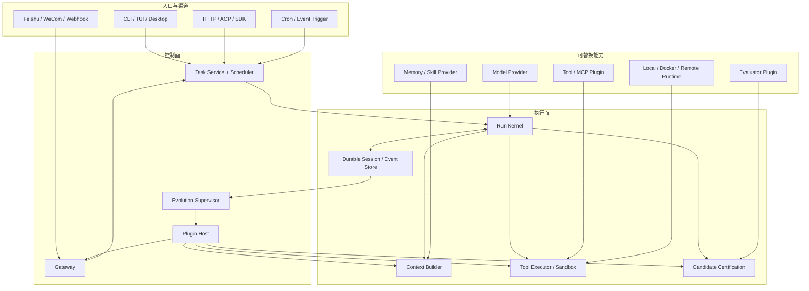

# RFC-002：Paw 真实场景 Coding Agent Platform 目标架构

> 状态：Proposed Long-term Blueprint（非当前实施清单）
> 日期：2026-08-16
> 决策范围：Paw 从单机 coding agent 演进为可长期运行、可自动化、可接入企业渠道、可受控自进化的 agent platform
> 当前生效范围：以 `SPEC-001-Paw-Platform-Refactor.md` v1.1 的 Active 工作包为准
> 权威决策：`ADR-001-Loop-Authority.md`、`ADR-002-Run-Completion-and-Certification-Authority.md`
> Loop 契约：`coding-agent-loop-kernel-v2.md` v2.1
> 当前代码基线：`main@07e92bf` 加未提交 WP1a 工作树

本 RFC 只定义终局方向与长期边界。它不把 Plugin Host、Automation、Gateway、多租户或 Evolution 同时设为当前 `MUST`，也不取代 SPEC 的阶段放行条件。

## 1. 一句话结论

Paw 不应继续在现有 `AgentOrchestrator` 周围横向增加飞书、微信、cron 和自进化代码。目标架构应收敛为：

> **一个纯粹、可重放、拥有唯一完成权威的 agent kernel；一个负责 durable session、工具执行、上下文与任务生命周期的 runtime；所有模型、工具、记忆、渠道、触发器和评测能力通过有权限边界的插件接入；自进化作为独立的离线控制面，只能发布经过回放、holdout、灰度和回滚保护的新版本。**

这允许大型改造，但拒绝一次性推倒重写。迁移必须逐层切权威、每步可回滚、每步有行为等价或新增能力的验收证据。

## 2. 用户目标如何翻译成工程目标

用户描述的目标包含六件不同的事，必须分层处理：

| 目标 | 正确归属 | 不应放在哪里 |
|---|---|---|
| harness + loop engineering | Kernel + Runtime | 单个 prompt 或 reviewer |
| 长时间复杂开发 | durable task state + session log + verification | 内存 flags 或无限上下文 |
| 记忆与技能学习 | Memory/Skill provider | Loop 内直接写数据库或文件 |
| Hermes 式自进化 | 独立 Evolution control plane | 正在执行任务的 live loop |
| 飞书/微信接入 | Gateway + Channel plugin | AgentOrchestrator 分支 |
| 自动化任务 | Scheduler + Task service + Worker | gateway 内的 timer callback |

最终产品不只是 CLI，而是一个可嵌入、可部署的 agent runtime。CLI、TUI、Desktop、飞书、企业微信、HTTP/API 和定时任务只是不同入口，它们必须驱动同一个任务与会话模型。

## 3. 当前 Paw 的真实基础与结构债

### 3.1 已经值得保留的基础

Paw 不是从零开始，以下资产应被迁移而不是重写：

- Loop v2 已有 provider terminal 归一化、证据投影、candidate readiness、semantic certification 和 artifact integrity。
- Harness 已有本地工具、MCP、sandbox/provenance、managed job 等执行能力。
- Memory v2 已有多租户 scope、Postgres、outbox、governor、生命周期和 MemoryAgentBench 证据。
- 已有 append-only JSONL run events、checkpoint/resume、context compaction/archive、verification evidence。
- CLI/TUI/Desktop 已证明同一产品可以有多个交互入口。
- SWE-Exp、MemoryAgentBench 与固定真实题轨迹已经构成初步 eval 基座。

### 3.2 不能继续放大的结构债

1. `@paw/core` 依赖 `@paw/memory`，同时 `@paw/memory` 又依赖 `@paw/core`。基础协议与具体记忆实现形成包级环，后续任何插件化都会被这条环拖回中心耦合。
2. `orchestrator.ts` 当前约 4,621 行、约 102 个 private methods；provider、context、memory、tool、resume、candidate、review、terminal 共享 mutable flags 和 side effects。
3. Loop v2 仍嵌在旧生命周期中：自然停止进入旧 `final_answer` 路径，v2 readiness 后仍可能经过旧 VerificationGate，最终 `RunResult` 仍由旧 CompletionPolicy 生成。
4. Session、AppState、run events、memory DB 和 candidate artifact 分别保存部分事实，没有一个统一的 run transaction/lease/attempt 模型。
5. MCP 和 skills 是扩展能力，但 Paw 没有正式 plugin manifest、权限声明、生命周期、隔离、版本兼容和卸载回收协议。
6. Managed jobs 解决的是一次运行内的后台工具，不等于可跨重启、可抢占、可审计的自动化任务系统。
7. 当前没有 channel-neutral gateway；把飞书 SDK 直接接进 agent 包会制造新的平台分支和隐式 session 规则。

因此，问题不是“功能太多”，而是**事实源、完成权威、依赖方向和进程边界没有统一**。

## 4. 参考实现研究结论

本 RFC 对照以下固定本地版本：

| 项目 | 本地 commit | 值得采用 | 不照搬 |
|---|---|---|---|
| DeepSeek Harness | `47f943859bef60e4160492346772ded9b24f765a` | durable session event、能力 seam、可回收注册、profile/bundle 组合、model-visible 必须可重放 | “万物皆插件”导致的包/概念膨胀和较高学习成本 |
| OpenCode | `864889ab9f9e921c240930b1dcd2bc0d2352c555` | server/client 分离、typed plugin hooks、domain rebuild、session/tool settlement | 过宽且可任意改写内部对象的 hooks；实验 API 漂移 |
| Pi | `46bb9a2c3bdb296b0d2179f7309ec6b79a7f3106` | 很薄的 inner loop、明确的 prepare/execute/finalize、顺序结果提交、项目/全局 extension discovery | extension context 同时暴露 UI、session、model 等大量能力，商业插件需更严格权限 |
| OpenHands Agent Canvas | `4f465f3ccada5271a3bbe4a0148941b0c40d243b` | frontend 与 Agent Server/Automation Server 分离、manifest preflight、runtime service discovery | 当前本地 checkout 主要是 Canvas 前端，不能把它当 agent loop 源码证据 |
| Hermes Agent | 在线文档，2026-08-16 查阅 | 一个 core 服务多个入口、统一 messaging gateway、平台 adapter、cron 任务、skills/memory、自进化配套 | 大型 `run_agent.py`/gateway 文件、import-time tool registration、默认自由写 skill、JSON cron store |

### 4.1 长任务与 loop engineering 的共同证据

- [LoopsBench](https://arxiv.org/abs/2608.00267) 把长任务建模为有依赖关系、可单独验证的开发单元；ready frontier 逐步释放，同时把已完成节点保留为 regression obligations。这说明“列了计划”不够，任务状态和回归义务必须由环境证据维护。
- [LongHorizon-Harness](https://arxiv.org/abs/2608.01964) 把 task state 放到执行上下文之外，只用独立验证的环境事实更新，并采用 Manage-Execute-Audit。这与 Paw 的 Working Decision State 和 candidate certification 方向一致，但 Paw 不需要强制每一步都调用三个模型；应先实现相同的状态与权限分离。
- [OpenAI Codex agent loop](https://openai.com/index/unrolling-the-codex-agent-loop/) 说明真正内循环可以很薄：模型响应、工具调用、结果回填、直到无工具调用。产品质量主要来自这个薄循环外围的上下文、工具、安全和持久化。
- [Anthropic 长任务 harness](https://www.anthropic.com/engineering/effective-harnesses-for-long-running-agents) 强调跨 context window 的结构化交接、清晰进度文件、增量工作和每次运行留下可用状态；[后续设计总结](https://www.anthropic.com/engineering/harness-design-long-running-apps) 进一步区分 planner/generator/evaluator，并要求用消融而不是直觉删机制。

### 4.2 Hermes 与自进化的关键证据

- [Hermes 架构](https://hermes-agent.nousresearch.com/docs/developer-guide/architecture) 让 CLI、Gateway、ACP、Batch、API 和 Library 复用同一个 AIAgent；平台差异留在入口和 adapter。
- Hermes gateway 证明渠道接入应统一做 authorization、session routing、delivery 和 platform capabilities，而不是让 agent 了解 Telegram/飞书等平台细节。
- [Hermes cron](https://hermes-agent.nousresearch.com/docs/user-guide/features/cron) 在 dispatch 前记录 execution attempt；重启后无法证明完成与否的 attempt 标为 `unknown` 且不自动重跑。这是商业自动化避免重复副作用的必要语义。
- [Hermes skills](https://hermes-agent.nousresearch.com/docs/user-guide/features/skills) 区分短事实 memory 与按需加载的长 procedure skill，并提供可跨重启的 staged diff/approve/reject。但其默认允许自由写 skill，不适合 Paw 的商业默认值。
- [Hermes self-evolution](https://github.com/NousResearch/hermes-agent-self-evolution) 采用“轨迹 → 候选变体 → 约束/测试 → PR”的外部优化流程，并明确禁止 mid-conversation 生效、要求语义保持和人工 review。
- [Agentic Harness Engineering](https://arxiv.org/abs/2604.25850) 的重要结论不是“让 agent 随便改 harness”，而是每次改动必须声明可证伪预测、保留可回滚组件版本，并用下一轮任务结果验证归因；其消融也把主要收益定位在 tools、middleware、memory，而非单纯 system prompt。
- [Self-Evolving Coding Agents survey](https://arxiv.org/abs/2608.03392) 把可进化对象分为 framework、memory、skills、tools、models 和协作结构，同时指出反馈可靠性、benchmark overfit、安全、维护成本和泛化风险。

## 5. 目标架构



### 5.1 五条不可违反的边界

1. **Kernel 不 import 具体 provider、memory、database、channel、UI 或 plugin loader。**
2. **Event Store 是运行事实源；projection、prompt、UI 和最终报告都是可重建视图。**
3. **只有 authority policy 可以拒绝工具；advisor、progress、cost 和 reviewer 不得伪装成权限。**
4. **渠道 delivery 与 agent completion 是两个独立事务。**任务完成但消息发送失败时重试 delivery，不重跑 coding task。
5. **自进化永远不修改 live session。**发布只影响新 run；核心 loop 变化必须经 PR/人工审查。

## 6. 代码与包边界

包不应为了“看起来模块化”无限拆分。只有依赖方向、部署、权限或独立版本确实不同，才形成 package。目标依赖保持单向：

```text
@paw/protocol
    ↑
@paw/kernel
    ↑
@paw/runtime
    ↑
@paw/coding
    ↑
apps/* and service compositions

@paw/plugin-sdk ──→ @paw/protocol
providers/plugins ──→ protocol + plugin-sdk
```

建议的稳定边界：

| 模块/包 | 职责 | 禁止依赖 |
|---|---|---|
| `@paw/protocol` | branded IDs、event envelopes、RunSpec/Outcome、tool/model/channel/task/plugin wire types、schema version | 任何 Paw 业务包 |
| `@paw/kernel` | 纯 run state machine、turn/tool settlement、terminal normalization、control state projector 接口 | DB、FS、memory、MCP、UI、具体模型 SDK |
| `@paw/runtime` | event store、leases、context composition、tool executor、sandbox、approval、resume、telemetry | 渠道 SDK、具体 app UI |
| `@paw/coding` | coding tools/profile、Working Decision State、verification、candidate certification、repo/worktree policy | 飞书/微信、scheduler 实现 |
| `@paw/plugin-sdk` | manifest、capabilities、permissions、registrations、lifecycle、compatibility | runtime 内部类 |
| `@paw/memory` | memory/skill provider 实现、governance、retrieval、distillation | `@paw/core`；改依赖 `protocol`/provider port |
| `@paw/automation` | task definition、trigger、attempt、scheduler、queue、retry/cancel | channel SDK、agent internals |
| `@paw/gateway` | channel-neutral envelope、auth、routing、delivery、attachment/capability negotiation | coding policy、model SDK |
| `@paw/evolution` | dataset、candidate、eval、promotion、canary、rollback | live kernel mutable state |

`@paw/core` 不应继续充当“所有共享东西”的杂物包。迁移后它要么被 `protocol + runtime` 完全替代，要么只保留短期兼容 re-export，最终删除。

## 7. Run Kernel：唯一循环权威

### 7.1 Kernel 的最小职责

- claim 输入并打开 durable turn；
- 从 Context Port 获取本轮 model input；
- 调 Model Port，并把流式响应持久化为事件；
- 规范化 provider terminal；
- 将每个合法 tool call 交给 Tool Scheduler；
- 保证每个调用都有明确 result/rejection/cancel settlement，按模型原顺序进入历史；
- 根据 durable control state 决定 continue、await user、candidate、incomplete、failed、aborted；
- 先 append event，再发布 projection。

Kernel 不负责检索记忆、不运行 reviewer、不生成 cron、不发送飞书消息、不加载插件、不维护 UI。

### 7.2 长任务控制状态

现有 Working Decision State v2 应扩展为 durable task projection，而不是 prompt 附件：

- goal 与 acceptance criteria；
- dependency/task graph 与 ready frontier；
- hypotheses、evidence gaps、behavioral invariants；
- current mutation revision；
- verification matrix 与 regression obligations；
- durable repair obligation；
- blocked/awaiting-user 原因；
- candidate/certification 状态。

模型可以提议 hypothesis/plan/next action；host 只能用环境事实更新 mutation、verification、tool result 和 acceptance。Crash/resume 后必须从 event log 得到相同状态。

### 7.3 不引入新的三模型强制循环

Manage-Execute-Audit 是职责边界，不等于每步都必须调用三个 LLM：

- Manage 默认由 deterministic projector + 当前主模型 plan update 完成；
- Execute 由同一 run 的模型和工具完成；
- Audit 优先用 tests/diff/static facts，只有语义风险时才调用 reviewer。

这样保留长任务可靠性，又避免把延迟和成本放大三倍。

## 8. Context Plane 与 Memory Plane

上下文和记忆不是普通插件功能，而是 Paw 的一级架构平面。当前已经实现的 ContextManager、ContextCompactor、budget allocation、protected constraints、archive/versioning、monitor、compression quality、system prompt、MemoryRuntimeV2、Memory Governor、outbox 和 utility lifecycle 都应保留并迁移到清晰边界；不重新实现第二套。

### 8.1 三种状态不能混在一起

| 状态 | 回答的问题 | 权威来源 | 生命周期 |
|---|---|---|---|
| Durable Task State | 当前任务真实做到哪里、还欠什么验证 | run event log + environment evidence | Task/RunAttempt |
| Working Context | 下一次模型调用应该看到什么 | Context Builder 生成的 prompt snapshot | 每次 model request |
| Long-term Memory | 跨会话值得保留什么事实、经验、偏好和 procedure | Memory Store + Governor | 跨 Task/Conversation |

Task state 不能只存在 compaction summary 或长期记忆中；长期记忆不能替代当前 revision 的测试事实；上下文只是选择后的视图，不能成为唯一事实副本。这个分离是长任务不跑偏、记忆不污染当前任务、crash/resume 可重放的前提。

### 8.2 Context Engine 的目标形态

Context Engine 属于 Runtime 的稳定能力，可先保留在一个 package 内，只有独立版本或部署需求出现时才拆成 `@paw/context`。它只接受结构化 `ContextBlock`，不允许子系统直接向 message array 塞自由文本：

```ts
interface ContextBlock {
  id: string;
  kind:
    | "identity"
    | "authority"
    | "task_state"
    | "repository_instruction"
    | "skill"
    | "memory"
    | "tool_observation"
    | "conversation"
    | "advisor";
  sourceRef: string;
  authority: "system" | "user" | "repository" | "host" | "learned";
  content: readonly ContentPart[];
  estimatedTokens: number;
  priority: number;
  freshness?: string;
  scope?: string;
  protected: boolean;
}
```

Context Builder 是模型可见内容的唯一注入点。每次请求落一条 `prompt.snapshot` 事件，保存或以内容寻址 artifact 引用最终 rendered request、完整 tool schemas、response format、模型精确 revision 与全部生成/reasoning 参数，以及 adapter 名称、版本/hash；同时记录 block IDs、内容 hashes、顺序、预算和裁剪/降级原因。只保存 tool schema hash 或若干 context block hash 不足以重建模型实际看到的请求。

现有机制按下列方式保留：

- ContextManager 迁移为 Context Engine 的 request-local assembler，不再拥有任务完成状态。
- token budget allocation 继续负责各域配额，但输入改为 typed blocks；不能按消息来源隐式猜优先级。
- protected constraints 扩展为 authority/task obligation/evidence pointer，不允许 compaction 删除。
- ContextCompactor 只压缩 conversation/tool transcript 视图；不得重写 acceptance、current revision、repair obligation 或 verification matrix。
- Archive/versioning 继续保存可寻址原始证据；summary 内使用 artifact/evidence refs，而不是复制后成为新事实源。
- Context Monitor 继续按 token/事件触发 compact/recall，但只发 advisor/request，不拥有 loop terminal 权限。
- memory retrieval 保持任务开始、失败、压缩后、用户纠正等事件触发，避免每轮全库检索和无差别注入。
- stable identity/tool guidance、repository instructions、task state、retrieved memory 和 volatile observations 分层组装，保证 prompt cache 稳定且来源冲突可解释。

### 8.3 当前 Memory v2 的去向

MemoryRuntimeV2 及 `记忆机制spec-v2` 的核心决策继续有效：Store 是正式记忆权威、Governor 是统一变更入口、Context Builder 是唯一注入点、学习路径只产候选。大型架构迁移只改变它与 Runtime 的依赖方式：

- `@paw/memory` 从 `@paw/core` 类型中解耦，改为实现 `@paw/protocol` 中的 MemoryProvider port。
- Runtime 不 import MemoryRuntimeV2；composition root 选择具体 provider，并把只读 port 交给 Context Engine。
- 检索返回 `MemoryInjectionPackage`，包含 memory id/revision/type/source/scope/applicability/score/content hash；实际注入结果写入 prompt snapshot，保证同一轨迹可解释。
- 写入仍走异步 outbox。只有 verified outcome、用户明确陈述或受治理事件可产生 candidate；模型、compactor 和 evolution supervisor 都不能绕过 Governor 直接写正式记忆。
- memory failure 保持 fail-open 到无记忆基线，但故障、降级和跳过原因必须可观测，不能静默把“没检索到”当“没有相关记忆”。
- semantic、episodic、profile、procedural 四类继续分治；vault 只保存 secret reference，不保存 secret value。
- 一次 RunAttempt 固定 memory policy 和 skill/plugin versions；允许检索内容随 query 变化，但每次实际注入的 revision 必须记录。新的 skill/prompt 版本只对新 run 生效。

### 8.4 程序记忆与自进化只保留一条链

现有 `08.程序记忆.md` 的 auto skill 计划不废弃，而是成为 Evolution Supervisor 的 E1 发布通道：

```text
verified successful trace
  -> distill reusable procedure candidate
  -> secret/schema/static guard
  -> replay/dry-run/critic
  -> staged skill diff
  -> approve or evidence-based promotion
  -> versioned skill registry
  -> new runs may retrieve it
  -> utility ledger observes use/outcome
  -> retain, revise, deprecate or rollback
```

Memory Distiller 负责从轨迹提炼候选；Evolution Supervisor 负责数据集、实验、版本和发布；Plugin Host 负责加载已发布 skill；Context Engine 负责按需注入；Memory Governor/skill governor 负责正式状态变更。它们共享一份 skill identity/version/utility ledger，不创建 Hermes-copy 或第二套 `.paw/skills/auto` 数据库。

### 8.5 上下文与记忆迁移验收

1. 相同 event log + artifact refs + provider snapshot 能重建相同 prompt block manifest。
2. compaction 前后 goal、criteria、current revision、repair obligation 和 verification matrix 完全一致。
3. memory on/off 只改变明确记录的 memory blocks，不改变 authority、tool policy 或评分器。
4. memory/provider 故障时主任务退化到 memory-off，且 trace 明确记录 failure class。
5. 跨 session recall 能指出具体 memory id/revision/source；旧或冲突记忆可被 Governor 失效。
6. 自动 skill 未通过 replay/approval 前不能进入任何新 run；发布后也不能改变已运行 session 的 tool/prompt snapshot。
7. 用 MemoryAgentBench 继续测召回/生命周期增益，用 SWE-Exp/真实任务测 memory on-off resolved delta；不能用内部夹具 SF 抬高公共 coding 能力。

## 9. Durable Session 与 Task Service

### 9.1 统一事实模型

区分三个概念：

- `Conversation`：用户可见的长期对话容器；
- `Task`：一个可调度、可取消、可重试的目标；
- `RunAttempt`：Task 的一次执行，拥有 immutable input snapshot、owner lease 和 event stream。

同一个 Task 可以有多个 attempt，但副作用重试策略必须明确。Session history 不等于 task state；对话可以产生多个 Task，一个自动化 Task 也可以附着到某个 Conversation。

### 9.2 存储策略

- 本地单机：SQLite event store + artifact directory，零运维可启动；
- 商业/多 worker：Postgres event store + object store，按 tenant/project/conversation/task/run 分区；
- Memory 可以继续用 Postgres，但只能通过 provider port 与 runtime 交互；
- JSONL 保留为 export/debug format，不再承担唯一在线事务语义。

所有 append 使用 expected sequence/CAS；worker 使用 lease + heartbeat；任何 model/tool-visible 内容都必须可从 event log 重建。

## 10. 插件系统

### 10.1 插件不是任意 hook

插件以 manifest 声明贡献点、权限和 API 版本：

```ts
interface PawPluginManifest {
  id: string;
  version: string;
  apiVersion: string;
  runtime: "in_process" | "worker" | "external";
  contributes: readonly PluginContribution[];
  permissions: readonly PluginPermission[];
  configSchema?: unknown;
}
```

首批贡献点限制为：

- `model_provider`
- `tool_provider`
- `runtime_backend`
- `context_provider`
- `memory_provider`
- `channel_adapter`
- `trigger_provider`
- `evaluator`
- `delivery_renderer`

不要一开始提供“before everything/after everything 并可修改任意对象”的万能 hook。稳定域使用 registry contribution；运行时拦截使用少量 typed pipeline，返回明确 decision，顺序、timeout 和 error policy 固定。

### 10.2 生命周期与回收

- `activate(ctx)` 返回 disposer；卸载后所有注册必须消失；
- project、user、built-in 三层 discovery，优先级与冲突规则确定；
- 配置变更构建新 registry snapshot，当前 run 固定使用创建时 snapshot；
- 每个 live run 对 snapshot/plugin version 持有 lease/ref-count；卸载先进入 draining、拒绝新 run，最后一个 lease 释放后才可 dispose 和删除；
- plugin upgrade 只影响新 run，不修改当前模型可见 prompt/tool schema；
- 插件 API 做 semver/compatibility preflight；不兼容时 fail loud，不静默跳过。

### 10.3 权限与隔离

权限至少包括 filesystem scopes、network domains、secrets refs、process、channel send、task create、memory propose。第三方高风险插件默认 worker/external process；in-process 只留给受信 built-ins。MCP 是一种 tool provider transport，不等于完整 Paw plugin。

## 11. Gateway 与飞书/微信

### 11.1 Channel-neutral envelope

每个平台先转换成统一入站事件：

```ts
interface VerifiedInboundEnvelope {
  tenantId: string;
  channel: string;
  accountId: string;
  conversationKey: string;
  threadKey?: string;
  sender: { id: string; displayName?: string };
  messageId: string;
  idempotencyKey: string;
  content: readonly ContentPart[];
  capabilities: ChannelCapabilities;
}
```

平台专用 verifier 负责对原始 bytes、headers、timestamp/nonce 和 signature 做校验，成功后才生成 `VerifiedInboundEnvelope`。Gateway 不实现飞书/微信私有密码学，只执行“未验证不得准入”、用户/群授权、幂等、canonical actor/conversation mapping、附件归档、typing/streaming、审批卡片和 outbound retry。Agent 只看到可信 user event 和 channel capability，不知道平台 SDK 类型。

### 11.2 接入顺序

1. Webhook/HTTP reference adapter：用来验证 gateway contract。
2. 飞书/Lark：企业场景清晰，支持机器人、事件订阅、卡片审批；作为第一个正式 channel plugin。
3. 企业微信 WeCom：与个人微信分开实现。
4. 微信/Weixin：只使用有稳定授权和合规边界的官方或可替换 bridge；社区个人号方案必须放在独立插件，不得进入 core SLA。

飞书和微信不应同时硬编码进第一版。先让 capability negotiation、thread/session mapping、幂等和 delivery retry 通过 contract tests，再增加平台。

## 12. 自动化任务

### 12.1 Task Definition

自动化不是“定时执行一段 prompt”，而是版本化定义：

- trigger：cron、webhook、manual、repository event；
- agent profile 与 plugin snapshot；
- 更新策略：`pinned(version)` 或 `track_release_channel(stable|canary)`；每个 attempt 保存解析后的不可变版本；
- workspace/runtime target；
- input template 与 secrets refs；
- concurrency/idempotency policy；
- approval policy；
- delivery target；
- timeout/retry/cancel policy；
- success criteria/evaluator。

### 12.2 Attempt 状态机

```text
scheduled -> claimed -> running -> completed | failed | cancelled | unknown
```

必须先持久化 claimed attempt，再启动 runtime。进程失联后，无法证明结果的 attempt 进入 `unknown`，默认不自动重跑；只有声明幂等且策略允许的任务才能重新执行。Agent completion 和 outbound delivery 分开记录，因此发送失败只重试 delivery。

### 12.3 进程边界

- Scheduler 只决定何时创建 attempt；
- Worker claim attempt 并运行 Paw runtime；
- Executor/sandbox 承担代码副作用；
- Delivery worker 发送结果；
- Gateway 不兼任持久化 scheduler。

本地 all-in-one daemon 可以把它们放在一个进程，但模块和事务边界保持一致，生产环境再独立扩展。

## 13. 受控自进化

### 13.1 允许进化的层级

| 等级 | 对象 | 默认发布策略 |
|---|---|---|
| E0 | profile、低风险事实记忆 | governor 自动裁决，可撤销 |
| E1 | procedural skill/SOP | staged candidate + replay/tests + 人审或可信自动晋升 |
| E2 | tool description、prompt section、context policy 参数 | 离线优化 + train/holdout + canary |
| E3 | plugin 版本、tool implementation | PR + 完整测试 + benchmark + 人审 |
| E4 | kernel/authority/security code | 永不自动部署；独立评审、固定公开 benchmark、灰度与回滚 |

这比 Hermes 默认自由写 skill 更保守，符合 Paw 已有 Memory Governor 和失败试用制。

### 13.2 Evolution pipeline

```text
Production traces / failures / user corrections
  -> redact + attribute + cluster
  -> build versioned train/dev/holdout dataset
  -> declare hypothesis and target metric
  -> generate candidate
  -> deterministic constraints + replay
  -> public/internal eval and regression checks
  -> staged artifact + diff/report
  -> approve/canary
  -> monitor
  -> promote or rollback
```

每次 evolution change 必须记录：改了什么、为何认为会改善、目标失败簇、候选版本、数据版本、baseline/candidate 结果、回归、成本、批准者和 rollback target。没有可证伪预测的变化不进入自动优化队列。

### 13.3 防止“越学越差”

- task 轨迹按 repo/time 分割，避免同题泄漏；
- public benchmark 不直接生成 task-specific rule；
- holdout 不参与候选生成；
- 任何单项关键安全/正确性回归都可否决总体均值提升；
- 新版本只进入新 run，活跃 run 固定 plugin/prompt/skill snapshot；
- 所有自动生成 skill 默认 staged，失败 skill 永不正式生效；
- core evolution 只能生成 PR，不能调用 git push/deploy 权限。

## 14. 部署形态

### 14.1 本地开发版

`paw daemon` all-in-one：SQLite、local artifact store、local worker、gateway 可选；CLI/TUI/Desktop 作为客户端连接 daemon。无 daemon 时可以 embedded compatibility mode 启动相同 runtime composition。

### 14.2 商业部署版

```text
API/Gateway replicas
  -> Task Service + Postgres
  -> Queue
  -> Worker pools
  -> isolated local/container/remote executors
  -> Object Store
  -> Delivery workers
  -> Evolution/Eval control plane
```

多租户 scope 从入口一路传播到 task、run、workspace、memory、artifact、secret 和 telemetry；不能在子系统里重新猜 tenant/project。

## 15. 迁移路线：允许大改，但不 big-bang

### Phase 0：冻结架构与基线

产出本 RFC、dependency rules、authority matrix 和现有 deterministic trajectory 基线。停止继续向 orchestrator 添加新产品域。

放行条件：目标依赖图和 legacy 删除条件明确；当前关键 loop tests/trace 可复现。

### Phase 1：小步解除 `core ↔ memory` 包环

- WP1a 只创建极小 `@paw/protocol` compat DTO，先消除 `core → memory`；
- compat 类型命名为 `LegacyMemoryRecordV1` / `LegacyProjectMemoryV1`，不冻结成公共平台协议；
- dependency gate 同时检查 manifest cycle、production source import 和 protocol 零依赖；
- WP1b 再通过 Memory port 消除 `memory → core`，此时才算完整解环；
- RunSpec/Outcome、events、tool/model/provider ports 只在真实跨进程消费者出现且契约稳定后逐项进入 protocol。

WP1a 放行条件：manifest 图无环、Core source 无 Memory import、Protocol 零生产依赖、运行行为不变、protocol/memory/agent/core 定向测试全绿。完整 Phase 1 还要求 `memory → core` 消失。

### Phase 2：Loop v2 成为唯一 Run Kernel

- natural stop 回归 turn boundary；
- durable repair obligation；
- v2 readiness 后不再走旧 VerificationGate；
- TaskState/CompletionPolicy 变为兼容 projector，随后删除；
- tool settlement、resume 与 terminal 全从单一 event stream 重放。

放行条件：ADR-001/ADR-002 authority matrix 与生产一致；crash/resume deterministic；固定复杂题能自然 mutation → verify → explicit candidate；v2 路径旧 VerificationGate/CompletionPolicy terminal 调用为 0。

### Phase 3：Runtime service 与 durable task model

- 引入 Conversation/Task/RunAttempt；
- 先落一个单进程、单 worker、单 durable store 的本地实现；
- event store port 只覆盖当前消费者，不同时实现 SQLite/Postgres 双栈；
- attempt/unknown 语义先成立；只有观测证明并发需求后才增加 lease/CAS、多 worker、Postgres/object store；
- CLI/TUI/Desktop 逐步改为 runtime client；
- orchestrator 拆成 composition root 和独立 services。

放行条件：同一 run 可在进程重启后续跑；单 worker 不重复执行 attempt；delivery 与 completion 可独立恢复。多 worker owner/lease 是条件性后续 gate，不阻塞本阶段。

### Phase 4：Automation 与 reference webhook

- Task Definition、scheduler、attempt ledger、worker、delivery；
- manual/webhook/cron 三种 trigger；
- cancel/resume/retry/idempotency；
- reference webhook 只使用普通内部 adapter，先验证 verifier/envelope/delivery contract；
- 自动化 UI/API 后接。

放行条件：crash、重复 tick、重复 webhook、delivery failure 和 unknown attempt 夹具全绿。

### Phase 5：正式 Gateway 渠道

- 飞书 adapter/verifier；
- 企业微信/微信 adapter/verifier；
- approval card、attachment、thread、streaming capability tests。

放行条件：channel contract tests、验签、幂等、安全和 session isolation 全绿；平台故障不影响 task truth。

### Phase 6：从真实消费者收敛 Plugin SDK 与 Host

- 把已投入使用的 model/tool/memory/verifier/channel/trigger/delivery adapter 收敛为 typed ports；
- 至少两个真实实现后再冻结 manifest、permissions、lifecycle、registry snapshot 与 compatibility preflight；
- project/user plugin discovery；
- snapshot lease/ref-count 和 third-party isolation。

放行条件：插件加载/卸载无残留；当前 run snapshot 不受热更新影响；越权被 executor 拒绝。

### Phase 7：Evolution Supervisor

- 先做 skill candidate pipeline，与现有程序记忆 v3 合并，不新建第二套 skill 系统；
- 再做 tool description/prompt section offline optimization；
- 最后只允许生成 core PR；
- 建 canary/rollback/version dashboard。

放行条件：候选可重放、holdout 隔离、回归 gate、staged approval、新 run 生效和 rollback 全有证据。

## 16. 第一实施切片

下一步不做飞书，也不立刻创建完整 daemon。第一切片固定为：

> **完成 WP1a：建立极小 `@paw/protocol` compat 层，先消除 `@paw/core → @paw/memory`，并增加 manifest/source/protocol dependency gates；不改变用户可见行为。**

选择它的原因：

- 它先提供解环所需的零依赖 compat 地基，但不预先承诺未来全部公共协议；
- 风险可通过 typecheck 和现有测试完整约束；
- 不会把新架构继续绑在旧 core/memory 环上；
- 失败时可单 commit 回滚，不影响当前 benchmark 基线；
- 它迫使我们先写清稳定 wire types，避免用 orchestrator 内部对象充当插件 API。

第一切片完成后，再做 Loop v2 authority cutover。两者不能倒序：在循环权威仍混合时直接建插件 host，会把旧内部类型永久公开。

## 17. 项目“做完”的定义

本项目不是“功能列表都有按钮”就结束，至少满足五层验收：

### A. Kernel correctness

- 单一 completion/verification authority；
- tool calls 全 settlement，无静默丢失；
- crash/resume/replay 一致；
- 长任务状态、回归义务和 repair obligation durable；
- orchestrator 不再是 god object，旧 TaskState/CompletionPolicy loop authority 删除。

### B. Coding ability

- Memory-off 固定复杂题先证明 Paw 本身能完成任务；
- 公共 SWE-bench Verified/Lite 固定子集报告 resolved、成本、时延、停止质量；
- LoopsBench 固定子集报告 development-unit progress、regression 和最终 resolved；
- Terminal-Bench 验证工具/环境能力；MemoryAgentBench 验证记忆增益；
- 同一 DeepSeek V4 Flash 配置下，再与本机 Claude Code CLI 做 paired comparison，报告 win/loss/tie 和失败归因。

### C. Platform reliability

- 24h/72h unattended soak；
- restart、network flap、provider retry、worker loss、duplicate event、unknown attempt 可恢复；
- 飞书至少完成消息、附件、thread、审批、长任务进度和最终 delivery；
- task truth、channel delivery、memory write 彼此故障隔离。

### D. Plugin and security

- 插件 API 有版本、权限、卸载、隔离、contract tests 和示例；
- tenant/workspace/secret/sandbox 边界端到端；
- audit log 能回答谁在何时用什么版本执行了什么副作用；
- 第三方插件不能绕过 executor authority。

### E. Safe evolution

- skill、tool description、prompt、plugin、core 五级发布策略落地；
- 数据版本、holdout、candidate diff、eval、canary、rollback 可查；
- live run 永不被热变更；
- 至少一次真实历史失败簇通过 evolution pipeline 改善，且公开/内部回归不过线时能自动拒绝。

达到以上标准后，Paw 才能被称为“可服务真实商业场景、且架构可持续演进的 coding agent platform”。超过 Claude Code 不是靠一个平均分宣称，而是同模型、同题、同环境的公开 paired evidence，加上 Claude Code CLI 不覆盖的记忆、企业渠道和自动化可靠性证据。

## 18. 明确否决的路线

- 在 `orchestrator.ts` 里增加 `if (channel === "feishu")`。
- 把 cron tick 放进 gateway，并用“上次时间”字段猜任务是否执行过。
- 允许 agent 在 live session 中重写自己的 prompt、skill 或 core code 并立刻加载。
- 为了插件化把每个 class 都拆成 package，复制 DeepSeek Harness 的全部框架复杂度。
- 让插件获得无边界 mutable runtime context。
- 同时维护第二套 memory/skill/evolution store。
- 先做漂亮平台 UI，再补 durable task/attempt 语义。
- 用更多 prompt nudge、更多预算或 benchmark 特判代替 loop authority 整改。
- 未固定数据集与版本就自动“优化”，把 benchmark 泄漏误当自进化。

## 19. 决策

若本 RFC 获得接受，Paw 的近期主线从“继续给现有 AgentOrchestrator 加能力”改为：

1. 先合并 SPEC v1.1、Loop v2.1 与 ADR-002 的 P0 契约；
2. 完成 WP1a compat 解环和更强 dependency gates；
3. Loop v2.1 单一权威切换；
4. durable runtime/task service；
5. automation 与 reference channel；
6. 由真实消费者收敛 plugin host；
7. controlled evolution。

每阶段都保持可运行产品、记录详细日志、完成定向验证、单独提交并推送。任何大型删除只在替代路径已经运行并通过同一 contract tests 后进行。
