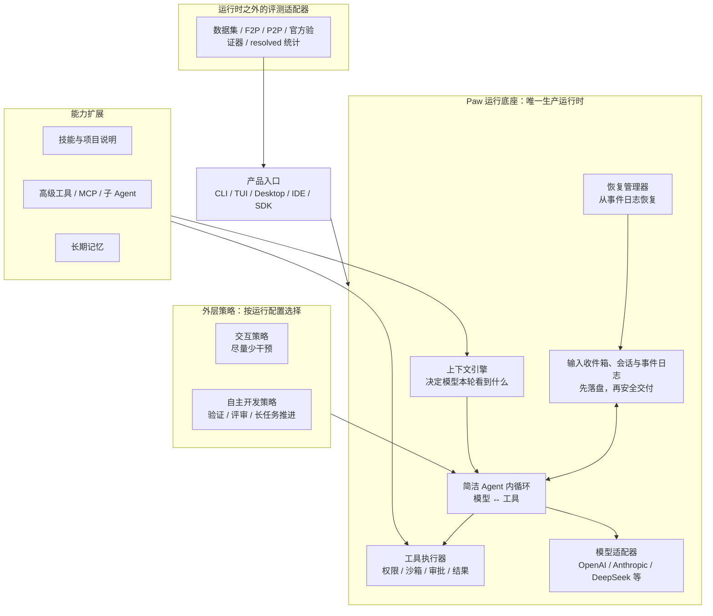

# RFC-003：Paw Next 单运行时与 Agent Loop Engineering 架构

> 状态：Accepted for staged implementation（用户已批准按阶段实施；尚未授权生产切流或删除旧运行时）
> 日期：2026-08-20
> 面向读者：产品负责人、架构设计者、Paw 开发者、评测维护者
> 决策主题：把 Paw 收敛为“Pi 式简洁内循环 + Paw 安全运行底座 + 可插拔外层策略”的通用 Coding Agent
> 与旧文档关系：本 RFC 聚焦 Coding Agent 的核心运行时；评审通过后还必须新增 ADR，明确取代 ADR-002/RFC-002/SPEC-001 的具体条款，在此之前不改变现行权威
> 本地参考：Pi `46bb9a2`、OpenCode `864889a`、Paw 当前工作树（含尚未提交改动）；本地 Claude Code 仓库为非官方源码整理，只作设计观察，不作实现权威或代码来源

---

## 0. 先用一句人话说明

Paw 不应继续在一个五千多行的主 Orchestrator 里同时处理模型对话、工具执行、测试、评审、任务计划、终止判断、SWE-bench 规则和崩溃恢复。

目标架构是：

> **只保留一个很小的模型—工具循环；把安全、会话、上下文和恢复做成稳定运行底座；把验证、评审、长任务推进和 benchmark 做成可选策略。**

最终只有一个生产运行时，不再存在 `v1 / v2-shadow / v2 / 未来 v3` 并行。

---

## 1. 为什么现在必须调整方向

过去 Paw 为了解决真实失败，逐步增加了很多有价值的能力：安全编辑、工具审计、恢复、候选评审、验证探针、外部验证、上下文压缩等。这些能力本身并不是错误。

真正的问题是：它们大多进入了同一条主循环，而且经常拥有相互重叠的状态和终止判断。结果是：

1. **运行时不止一套。** 当前有 `v1`、`v2-shadow`、`v2` 三种 Loop Kernel；默认仍能回到 v1。
2. **主循环承担过多职责。** `orchestrator.ts`、`action-handlers.ts`、`tool-runner.ts` 三个中心文件合计约 9,500 行；再加验证探针约 2,000 行。
3. **控制权重复。** 旧 CompletionPolicy、VerificationGate、Loop v2 reducer、candidate readiness、review/probe 都可能影响“是否继续”和“能否结束”。
4. **事实源重复。** SessionStore、AppState、Context history、Loop v2 projection/checkpoint、candidate artifact 分别保存部分运行事实。
5. **benchmark 语义进入通用 Agent。** Agent 包直接识别 `FAIL_TO_PASS`、`PASS_TO_PASS`、public benchmark 等 SWE 语义。
6. **失败容易推动架构过拟合。** 一道题失败后，很容易在生产主循环中加入新的正则、门禁或专用提示；单点可能合理，累积后却使通用 Agent 越来越重。
7. **每轮成本变高。** 大量 HostState、控制提示、评审和探针会增加模型调用、上下文长度和延迟。

这说明 Paw 当前更接近“带大量 benchmark 控制规则的自动修题系统”，还不是一个边界清楚的通用 Coding Agent。

---

## 2. 三个容易混淆的概念

### 2.1 Agent 内循环：模型和工具如何来回工作

英文常写作 **Agent Loop**。它只处理最基本的一次循环：

1. 准备本轮上下文；
2. 调用模型；
3. 如果模型要求使用工具，就执行工具；
4. 把工具结果交回模型；
5. 如果模型没有工具调用，再询问外层策略是结束、暂停还是继续。

内循环不应该知道 SWE-bench、F2P/P2P、pytest、候选评审或长期任务计划。

### 2.2 运行底座：让内循环安全、可恢复地运行

英文常写作 **Harness**。本文称为“运行底座”。它负责：

- 保存会话和事件；
- 执行工具；
- 管理沙箱、权限和审批；
- 构建模型上下文；
- 在上下文过长时压缩；
- 在崩溃后恢复；
- 适配不同模型供应商；
- 给 CLI、Desktop、IDE 和评测提供同一套能力。

运行底座保证“手脚可靠”，但不代替模型决定代码方案。

### 2.3 Agent Loop Engineering：优化整个工作闭环

本文译作“智能体循环工程”。它关注的不只是内循环代码，还包括：

- 什么时候继续调查；
- 什么时候运行验证；
- 什么信息进入下一轮上下文；
- 什么时候触发辅助评审；
- 长任务如何拆分和恢复；
- 怎样减少重复读取、无效命令和重复模型调用；
- 怎样判断完成，而不把失败伪装成成功。

它不等于“在主循环里添加更多 if、正则和门禁”。正确做法是把这些能力放到可观察、可替换、可消融比较的外层策略中。

### 2.4 术语白话表

正文会保留必要代码名，但功能说明优先使用中文。

| 英文或代码词 | 本文中文叫法 | 白话解释 |
|---|---|---|
| runtime | 运行时 / 运行底座 | 真正把一次 Agent 任务跑起来的程序 |
| profile | 运行配置 | 同一运行时装配哪组策略和权限 |
| candidate | 候选完成结果 | Agent 认为可以交付的一版代码和说明 |
| acceptance ledger | 验收事项表 | 记录用户要求和仍需满足的条件 |
| native tool turn | 原生工具往返 | 保留模型供应商原始 ID 的工具调用和结果 |
| reasoning passback | 推理状态回传 | 某些供应商要求下一轮带回的原生推理字段；不同于审计日志 |
| projection | 派生视图 | 从事件日志计算出的状态，不是新的事实源 |
| effect | 动作请求 | 策略希望运行底座执行的验证、评审或控制提示 |
| checkpoint | 恢复快照 | 为快速恢复保存的已知状态位置 |
| checkpoint + tail | 快照加尾部日志 | 先加载快照，再重放快照之后的事件 |
| steering | 途中追加指引 | 一轮执行过程中用户或宿主补充的新要求 |
| steer | 尽快转向 | 新输入先落盘，在当前工具安全结算后、下一次模型调用前插入 |
| queue | 排队处理 | 新输入先落盘，等当前工作真正空闲后按先来后到逐条处理 |
| prompt admission | 输入接纳 | 先把输入可靠记入会话，再决定何时交给 Agent 执行 |
| tool materialization | 本轮工具装配 | 根据权限和任务，为本轮生成确定的可见工具清单 |
| abort | 中止 | 用户取消、超时或安全原因导致停止 |
| manifest | 评测清单 | 数据集题目、镜像、规则和预算的结构化说明 |
| held-out | 留出题集 | 开发时完全不看、只用于检验泛化能力的任务 |
| reviewer | 辅助评审器 | 另一个模型或规则，对候选代码提出风险意见 |
| probe | 验证探针 | 在只读隔离环境中尝试证伪候选的小验证 |
| prompt cache | 提示缓存 | 模型供应商复用相同提示前缀，减少成本和延迟 |
| wall-clock time | 实际用时 | 从任务开始到结束，用户真实等待的时间 |

---

## 3. Pi、OpenCode、Claude Code 给 Paw 的启发

### 3.1 Pi：内循环要小，扩展按需加载

Pi 的成熟 `agent-loop.ts` 约 800 行，核心思路很简单：模型响应、工具调用、工具结果、下一轮准备，直到没有工具调用或外层要求停止。

Pi 默认只给模型四个工具：

- `read`：读取文件；
- `write`：写文件；
- `edit`：局部编辑；
- `bash`：运行命令。

额外能力通过扩展、技能和模板加载，而不是全部塞进默认提示。

Paw 不应照搬 Pi 的全部设计。Pi 的默认安全、审计和崩溃恢复能力没有 Paw 完整；Pi 新的 durable harness 文档也仍有不少未实现代码。Paw 应采用的是它的**简洁内循环和按需扩展原则**，同时保留自己的安全优势。

### 3.2 OpenCode：输入先可靠接纳，再在安全边界交付

OpenCode 新一代 Session 设计中，最值得 Paw 吸收的不是框架写法，而是三条会话语义：

1. **用户输入先持久化，再唤醒执行器。** 输入写入失败时不能开始模型调用；执行器被唤醒失败时，输入仍留在会话里，之后可以继续处理。
2. **“尽快转向”和“排队处理”是两种不同交付方式。** 尽快转向只在当前工具调用已经安全结算、下一次模型调用尚未开始时插入；排队处理则等当前连续工作结束，再按先来后到取一条。
3. **同一输入 ID 必须严格幂等。** 只有会话、正文和交付方式完全一致，才可视为同一次重试；同 ID 不同内容必须报冲突，不能静默覆盖。

它还证明了几个有用的工程边界：同一会话的重复唤醒应合并，不要启动两个执行器争抢；不同会话可以并发；每个模型回合只建立一条模型流；每回合从持久事实重新投影历史和工具，而不是信任进程内旧对象。

Paw 不照搬 OpenCode 目前“旧 Session + 新 Session V2”并存的迁移形态，也不整体引入它采用的 Effect 服务框架。我们只吸收上述可测试的协议语义，仍坚持最终单运行时。

### 3.3 Claude Code：工具按需发现、统一权限和缓存稳定

本地 Claude Code 仓库明确标注为非官方泄露源码整理，因此本文不复制其代码，也不把内部实现当成事实标准。可吸收的只是与公开产品行为相符的高层思想：

- 工具自带输入结构、只读/可写属性、权限类别和“能否安全并发”声明；
- 默认只展示少量常用工具，高级工具和 MCP 工具需要时再发现，避免每轮发送庞大工具说明；
- 权限由一个中心统一解释，区分本次允许、长期允许、询问和拒绝，不能由各工具自行发明规则；
- 重型可选模块延迟加载，互不依赖的启动检查并行执行；
- 稳定的系统提示和工具顺序用于提高提示缓存命中率；
- 上下文压缩必须留出模型输出空间，并在连续失败后熔断，避免每轮反复调用失败的压缩器。

这些能力应进入 Paw 的运行底座和工具元数据，而不是让主循环变成新的大型 Query Engine。

### 3.4 四者如何组合，而不是互相照抄

| 来源 | 主要吸收 | Paw 不照搬的部分 |
|---|---|---|
| Pi | 极小模型—工具内循环、少量默认工具、扩展按需加载 | 较弱的安全、审计和崩溃恢复边界 |
| OpenCode | 输入先落盘、尽快转向/排队处理、安全边界、严格幂等、每回合重投影 | 新旧两套 Session 长期共存、整套服务框架 |
| Claude Code | 动态工具发现、统一权限、并发声明、稳定提示缓存、压缩熔断 | 非官方源码细节、巨型中央状态对象、供应商特例网 |
| Paw | 安全编辑、工作区副作用审计、原生工具协议、唯一终局权威、可恢复日志 | 当前多运行时、benchmark 进入核心、大型 Orchestrator |

目标不是做一个混合大杂烩，而是：**Pi 决定内循环应有多小，OpenCode 提醒会话输入如何可靠交付，Claude Code 提醒产品级工具和权限如何高效装配，Paw 保留自己最强的安全与恢复能力。**

---

## 4. 目标架构总览



架构只有一个运行时，但可以选择不同运行配置。运行配置不是另一套 Loop，只是给同一个 Loop 装配不同策略。评测适配器位于运行时之外：它像普通用户一样发起任务，任务结束后再调用官方验证器和计算分数。

---

## 5. 每个模块到底干什么

### 5.1 简洁 Agent 内循环

建议新包名：`@paw/agent-loop`

职责：

- 接收用户请求；
- 从上下文引擎取得本轮消息；
- 调模型并处理流式输出；
- 校验模型工具调用；
- 调工具执行器；
- 将模型消息和工具结果写入会话；
- 把模型停止、工具结算和策略请求写成事实；
- 调用唯一运行控制归约器决定下一步。

明确不负责：

- 不解析 F2P/P2P；
- 不维护 acceptance ledger；
- 不直接运行 semantic reviewer；
- 不理解 pytest 或任何具体测试框架；
- 不决定 benchmark 是否 resolved；
- 不直接操作数据库和文件系统；
- 不加载 UI、渠道或评测代码。

核心伪代码只表达事务顺序，不代表最终接口名称：

```ts
while (!signal.aborted) {
  const request = await context.build(session, visibleTools);
  await session.appendInput(modelRequestIntent(request.snapshot));

  const response = await settleModelCall(request); // 永不把模型异常裸抛出
  // 完整模型结算与其中全部原生工具调用观察必须原子落盘；这里只记录模型
  // 提出了什么，不在外层直接派发工具。
  const modelFacts = [
    modelSettlement(response),
    ...toolCallObservedFacts(response.toolCalls),
  ];
  await session.appendInput(modelFacts);
  let state = await reconcileFromNewFacts(modelFacts);
  if (state.isTerminalOrWaiting) return state.outcome;
  if (response.kind !== "success") continue;

  if (response.toolCalls.length > 0) {
    // 工具派发、执行和结算只有 reconcileFromNewFacts 中的一条路径；外层
    // 不得再次追加 intent 或直接调用工具，避免双派发与非 CAS 副作用窗口。
    continue;
  }

  await session.appendInput(modelTurnStopped(response));
  state = await reconcileFromNewFacts([modelTurnStopped(response)]);
  if (state.kind === "continue") continue;
  return state.outcome;
}

// 用户取消和超时也必须先落事实，再经过同一个归约器。
if (signal.aborted) {
  await session.appendInput(runAborted(signal.reason));
  return (await reconcileFromNewFacts([runAborted(signal.reason)])).outcome;
}

async function reconcileFromNewFacts(facts: readonly InputFact[]) {
  let pendingFacts = facts;
  while (true) {
    // Live 路径才运行策略；replay 直接读取持久化的 PolicyRequestFact。
    const requests = await policyCoordinator.observe(
      pendingFacts,
      frozenRunConfig,
    );
    await session.appendInput(policyRequestFacts(requests));

    const snapshot = session.readInputSnapshot();
    const state = controlReducer.reduce(snapshot.inputFacts, frozenRunConfig);

    // “允许继续”的决定和整批派发意图必须使用同一个 expected-tail
    // 原子提交。若期间插入 abort、新输入或其他事实，CAS 失败并从头归约；
    // 旧决定绝不能越过新事实触碰真实工具。
    const actionIntents = state.actionsToDispatch;
    const committed = await session.commitDecisionAndInputFacts(
      snapshot.tailSeq,
      controlDecision(state, snapshot.inputThroughSeq),
      actionIntents,
    );
    if (!committed) {
      pendingFacts = [];
      continue;
    }
    if (actionIntents.length === 0) return state;
    const settlements = await actionExecutor.executeSettled(actionIntents);
    await session.appendInput(settlements);

    // 动作结算成为下一轮待观察事实，再跑策略和归约器。
    pendingFacts = settlements;
  }
}
```

必须满足的结算规则：

- 模型请求在调用前记录请求快照和调用意图；
- 模型调用必须结算为成功、失败、取消或结果未知；调用抛错由边界转换成结算事实；
- 原生工具调用 ID、名称和原始参数必须完整保存；
- 可能产生副作用的工具在执行前先记录派发意图；
- 允许执行的派生决定与其整批派发意图必须按同一个日志尾游标原子提交；发生 CAS 冲突时重新归约，旧决定不得继续产生副作用；
- 每个调用最终必须结算为成功、失败、拒绝、取消或结果未知；
- ToolExecutor 即使内部批处理失败，也必须为尚未证明结果的每个调用返回 `unknown`，不能让整个批裸抛；
- 有派发意图但崩溃前没有结算的副作用调用，恢复时标为 `unknown` 并等待人工/环境核对，不得自动重试；
- 并行执行可以乱序完成，但交回模型时必须恢复模型原始调用顺序；
- 工具调用和对应结果作为一个原子上下文单元保留，不能只留结果不留调用；
- 验证、评审等动作请求必须先写入日志，执行完成后再写结算事实；
- 每个动作请求有稳定 ID；归约器只派发“尚无派发意图”的请求，恢复时看到意图但没有结算不得自动重复副作用；
- 重放日志只运行纯派生计算，不重新调用模型、工具、评审器或非确定性策略；
- 策略和统一归约器在相同输入、相同版本下必须产生相同结果。

目标：核心控制流保持在约 500–1,000 行以内。代码行数不是硬指标，但超过后必须证明为什么职责仍属于内循环。

### 5.2 会话与事件日志

建议归属：`@paw/runtime`

职责：

- 用追加写方式记录用户消息、模型消息、工具调用、工具结果和控制决定；
- 给每条持久事件分配稳定顺序号；
- 支持恢复、压缩和审计；会话分支列为后续能力，不阻塞首版；
- 成为“这次运行真实发生了什么”的唯一事实源。

原则：

- AppState 不再复制完整运行事实；
- Loop 派生视图只是从日志计算出的展示状态；
- candidate、verification、UI 状态都不能反过来覆盖日志事实；
- 流式 token 可以只发给 UI，不必逐 token 写入主日志；最终完整模型消息必须持久化。

协议必须把日志记录分成两类，禁止混用：

| 类型 | 内容 | 能否作为归约器输入 |
|---|---|---|
| `InputFact`（输入事实） | 用户输入、模型结算、工具派发/结算、验证结果、评审结果、中止/超时、已记录的策略请求 | 可以 |
| `DerivedDecision`（派生决定） | 归约器根据某一段输入事实计算出的状态、继续/等待/终局决定及其 hash | 不可以 |

每条派生决定都记录 `inputThroughSeq` 和状态 hash，表示它基于哪一条输入事实计算。重放时只把 `InputFact` 重新交给归约器，再用结果校验日志中的 `DerivedDecision`；不能把过去的决定再次当输入，否则会形成第二套终局权威或自我循环。

#### 5.2.1 输入收件箱与安全交付

产品入口不能直接把一段新文字塞进正在运行的模型请求。所有用户输入先进入同一个持久“输入收件箱”，记录：

- `inputId`：调用方生成的稳定 ID；
- `sessionId`：属于哪个会话；
- `delivery`：`steer`（尽快转向）或 `queue`（排队处理）；
- 正文、附件引用和内容哈希；
- 接纳顺序号、接纳时间和调用方身份。

接纳规则：

1. 先追加持久输入事实，成功后才能唤醒会话执行器；
2. 相同 `inputId` 只有调用方提供的不可变字段（会话、交付方式、正文、附件和内容哈希）完全一致时才返回“已接纳”，否则报幂等冲突；服务端生成的顺序号和时间不参与重试等价判断；
3. 同一会话同时只允许一个执行器拥有执行权；重复唤醒只合并信号，不启动第二条 Loop；
4. 不同会话可以并发运行，但仍各自遵守工作区锁和工具权限；
5. `steer` 只在安全边界提升：当前工具调用和日志结算完成之后、下一次模型请求意图写入之前；
6. `queue` 只在当前连续工作结束或进入空闲后提升，每次按 FIFO 取一条，避免一次塞入大量旧指令；
7. 一条输入被提升时写入明确事实；崩溃恢复后，已经提升的输入不能再次提升，尚未提升的仍可处理。

“安全边界”绝不包括工具执行中途、文件写入一半、并行批次只完成一部分或模型请求已经发出以后。这样既能让用户及时纠偏，也不会制造半条工具事务。

#### 5.2.2 每个模型回合重新读取事实

每个供应商模型回合必须：

1. 从 journal 投影最新消息、已提升输入和工具结算；
2. 重新计算本轮可见工具和权限；
3. 记录模型请求快照与哈希；
4. 只建立一条模型流；
5. 流结束后完整结算，再决定是否开始下一回合。

这会稍微增加纯投影工作，但消除了进程内旧状态、后台结算和用户 steer 之间的竞态。可通过缓存投影结果优化，不能通过跳过 journal 真相来优化。

### 5.3 上下文引擎

建议归属：`@paw/runtime/context`

职责：

- 组合 system prompt、项目规则、用户消息、工具结果、任务摘要和按需记忆；
- 控制 token 预算；
- 保证 assistant 工具调用与观察结果不被截断拆开；
- 执行压缩并保存被省略内容的来源引用；
- 生成最终给模型的请求快照和哈希，方便复盘。

压缩还必须满足：

- 先预留本轮模型输出预算，再计算可用于历史的 token；
- assistant 工具调用及其观察作为一个完整单元保留或整体压缩；
- 压缩摘要写成明确边界和来源引用，不能伪装成原始用户消息；
- 最近正在工作的文件、未结算动作和当前用户输入优先保留；
- 连续压缩失败达到阈值后，本次 run 熔断自动压缩，并追加 `context.compaction_failed` 或 `context.exhausted` 输入事实，不能每轮重复烧模型调用；只有唯一 ControlReducer 能根据该事实决定继续、等待用户或 incomplete；
- 压缩失败计数持久化并绑定 run 和 context revision，只在成功压缩、明确人工处理或新 run 时重置，不能每个模型回合自动清零；
- 不变的 system、项目规则和工具前缀保持确定顺序，优先利用提示缓存。

不负责：

- 不判断任务完成；
- 不把摘要当成新的事实权威；
- 不永久保存每轮重复生成的 HostState 文本；
- 不根据 benchmark 名称决定优先级。

### 5.4 工具执行器

建议归属：`@paw/runtime/tools`

职责：

- 工具注册和按需暴露；
- 参数校验；
- 审批、只读/可写权限和沙箱；
- 文件修改前后快照；
- 工具结果截断、归档和审计；
- 崩溃情况下避免把“可能执行过”当成“肯定没执行”。

每个工具必须声明一份统一元数据：

| 字段 | 用途 |
|---|---|
| 输入 schema | 在执行前校验模型参数 |
| 基础 effect 提示 | 工具类型通常是只读还是可写；只作默认提示，不替代参数级分类 |
| `classify(validatedInput)` | 根据本次已校验参数返回副作用类别、规范化资源作用域、并发模式和权限类别 |
| `deferred` | 是否默认不发送定义、需要时再发现 |
| `resultPolicy` | 结果如何截断、归档以及哪些字段必须保留 |

Shell、Git、MCP 等工具的副作用取决于参数，不能依赖一个静态 `readOnly` 或 `concurrencySafe` 布尔值。执行器必须先校验参数，再调用：

```text
classify(validatedInput)
  → effectClass
  → mutationScopes
  → concurrencyMode
  → permissionCategory
```

无法可靠分类的调用一律按“可能写入、独占执行、需要权限检查”处理。只有所有调用在本次参数下都允许并发、规范化后的全局资源作用域不冲突、供应商协议能完整保留调用 ID 时才并发执行。不同会话若共享工作区，也必须竞争同一全局资源锁，不能只在各自 Session 内判断。无论实际完成顺序如何，结算交回模型必须恢复源顺序。工具执行前的派发意图和必要工作区快照必须先落盘，避免供应商 SDK 或并发执行早于审计事实。

权限由一个中心解释，不允许工具各写一套规则。最小结果为：

- `allow_once`：只允许当前精确调用；
- `allow_rule`：用户明确授权与模式匹配的后续调用；
- `ask`：暂停并询问；
- `deny`：拒绝并记录原因。

权限有不可反转的层级：硬安全/沙箱拒绝 > 管理员拒绝 > 用户授权 > 默认规则。低层级的允许永远不能覆盖高层级的拒绝；“最后一条匹配规则生效”只允许在同一权限层内部使用。

RunAttempt 开始时冻结基础权限版本。运行中用户作出的 `allow_once` 或仅限本 run 的 `allow_rule` 必须作为新的 `InputFact` 追加，形成可审计的 run 内授权覆盖层；管理员或用户写入的持久授权经治理配置保存，只影响后续 run。模型永远不能创建、扩大或持久化授权。

Paw 现有安全编辑、撤销、工作区副作用审计、Docker/本地沙箱、原生工具往返等能力应保留在这里。

默认工具建议收敛为：

- 读取文件；
- 编辑文件；
- 写入文件；
- 运行 shell；
- 可选的补丁工具。

搜索、LSP、浏览器、notebook、MCP、子 Agent、后台任务等能力按任务和技能动态暴露，避免每轮都给模型完整工具说明。

动态暴露不是运行时随意热加载代码。本轮工具装配器只能从 RunAttempt 开始时冻结的工具注册表中选择子集：

1. 少量基础工具始终可见；
2. 高级工具先通过工具搜索或技能选择发现；
3. 根据权限、模型能力和任务上下文过滤；
4. 按稳定名称排序，生成可见工具集合哈希并写入模型请求快照；
5. 注册表版本在 run 内不变，扩展安装或升级只对下一次 run 生效。

### 5.5 模型适配器

建议保留：`@paw/models`

职责：

- 把统一请求转换为各供应商协议；
- 保留原生工具调用 ID 和参数；
- 正确处理流式、推理内容、重试和 token 使用量；
- 暴露模型能力，例如是否支持并行工具、推理开关、上下文上限。

它只处理协议，不决定什么时候评审、什么时候跑测试。

为提高效率，模型适配器还应暴露稳定的提示缓存键、首 token 延迟和缓存命中用量，但不能把某个供应商的缓存或推理字段泄漏成内循环分支。相同会话、相同稳定前缀和相同工具集合应尽量产生一致序列化结果。

> 2026-08-24 KV-cache 第一阶段实施记录：OpenAI-compatible usage 已统一接收 OpenAI `prompt_tokens_details.cached_tokens` 与 DeepSeek `prompt_cache_hit_tokens` / `prompt_cache_miss_tokens`，并将 provider-neutral 的 `cachedPromptTokens`、`cacheMissPromptTokens` 随 `ModelResponseV1` 写入 canonical `model.settled` durable payload。共享 `CostTracker` 同时累计 root/child 的 hit、miss、命中率与分档费用。Context 物化现保留 task checkpoint 在稳定 system 前缀之后作为 cache epoch，快速变化的 runtime activity 改为尾部 system evidence，避免每轮在历史前部截断 DeepSeek 前缀缓存；path/shell/permission guard 未改变。已通过 protocol、models、core、runtime、model-output-recovery、V1 composition 与 V2/V3 multi-agent composition 回归；下一阶段仍需真实 DeepSeek 连续多轮 smoke，记录冷启动/稳态 hit rate、TTFT 和 cost per resolved task。

> 2026-08-24 DeepSeek V4 Flash 实测：新增 `paw-next-kv-cache-smoke.driver.ts`，逐调用记录 prompt hit/miss、命中率、completion、累计费用、结算状态及 root/child session 身份，错误信息在落盘前脱敏。单 Agent `read → edit → test → final` 共 4 次调用：19,794 prompt tokens、14,464 cache-hit、整体命中率 73.1%、估算 CNY 0.006285，较全 miss 估算节省 69.3%，宿主测试通过；第 2–4 次稳态命中率为 90.6%、92.7%、97.4%。多 Agent `delegate investigator → root edit/test/review/final` 共 15 次调用：91,699 prompt tokens、72,448 cache-hit、整体命中率 79.0%、估算 CNY 0.029423，较全 miss 估算节省 70.7%，宿主测试通过并自然完成；root 9 次调用命中率 87.8%，独立 child 6 次调用命中率 39.8%，说明子 Agent 的冷前缀是当前主要缓存成本。两次失败试跑分别验证了 `workspace.run_agent` 和只读 `workspace.git_diff` 未授权时会被 frozen permission policy 明确拒绝；最终 smoke 只增加 delegate 精确授权和 read 类授权，没有扩大 child 写边界。TTFT 尚未采集，留待下一阶段。

> 2026-08-24 子 Agent cache-prefix P0：参考 Reasonix 的“稳定系统契约 + 动态任务后置”做法，`buildChildSystemPrompt` 现仅包含固定 child contract、冻结工具目录和 workspace identity；每次调用的 role/goal/facts/constraints/artifacts/progress/risks/parent conclusions/output format 改写入版本化首条 user envelope `paw.subagent-task.v1`。该首条非工具 user turn 已由 `ContextManager` 长期保护，普通历史裁剪不会丢任务；恢复旧 child checkpoint 时会去除旧动态 system 并在历史最前自动重建 envelope，新格式恢复不重复插入。动态文本中的 envelope 闭标签会转义，父级 facts/artifacts 明确降为 evidence，不能覆盖系统权限和任务边界。新增跨任务 system 字节一致、动态信息隔离、工具/workspace cache identity、标签转义和 legacy resume 回归，定向测试 10/10 通过，Agent typecheck 通过。真实 DeepSeek multi smoke 共 12 次调用，73,411 prompt tokens、62,464 cache-hit、整体命中率 85.1%、估算 CNY 0.018910，宿主测试通过；新增 `paw-child-prefix-cache-smoke.driver.ts` 用同一 workspace 顺序运行两个不同 child，第二个 child 首次请求 6,016 prompt tokens、5,504 cache-hit，跨 child 前缀命中率 91.5%，证明收益不是同一会话历史增长造成。报告分别位于 `E:/A_Louis/paw-kv-cache-smoke-multi-child-prefix/.paw/kv-cache-smoke-report.json` 与 `E:/A_Louis/paw-kv-cache-child-prefix-p0/.paw/child-prefix-cache-smoke-report.json`。下一阶段是冻结 MCP provider-visible 工具面并通过固定代理发现动态能力。

> 2026-08-24 MCP cache-prefix P1：`@paw/harness` 与 `AgentOrchestrator` 的 MCP 路径已从“每个动态 `mcp:<server>/<tool>` 直接进入 provider schema/system catalog”改为唯一固定代理 `workspace.use_mcp`。代理以 `action=search` 返回当前 run 精确授权的候选、描述和 input schema，以 `action=call` 调用一个 exact id；动态 inventory、连接顺序和 server 数量不再改变 `toolDefinitions`、`toolNameReverseMap`、`listToolNames` 或文本 catalog。旧 exact MCP allowlist 会映射为 provider 只见代理、宿主仍只允许原 exact targets，未扩大到整台 server；直接动态 MCP 名称不进入 parser known-tools。`search` 不需审批但返回内容统一标为 `mcp/external_untrusted_data`，`call` 保持审批与 execution/effect policy，read-only child 只能发现不能调用；无 MCP、非法 id、非对象 arguments 和越权 target 均 fail closed。当前 Windows 完整 schema 为 35 个工具、18,328 bytes、SHA-256 `0c9223da2ec52b3d78184efd30c6af4e957f8dc16432326db13a9a33532096e2`，该身份不随 MCP inventory 改变。MCP/registry/capability/provenance 定向回归 62/62 通过，Agent typecheck 通过；Harness 全包 typecheck 被本分支既有的 `shell/session.ts` 三处无关错误阻断。此切片只覆盖现有 Harness/AgentOrchestrator MCP 通路；canonical Paw Next V3 root 尚未把 MCP connection/plugin 纳入冻结 Product Profile，因此不宣称 V3 root 已支持 MCP，后续接入必须沿 Runtime plugin/registry 权威实现，不能回退到动态 provider schema。

> 2026-08-24 MCP cache-prefix P2（canonical Paw Next V3 root）：V3 Profile 新增严格解析、深冻结并规范排序的 `paw.mcp-runtime.v1` 配置，包含 stdio server 启动参数与 exact `allowedTools`；server/env/allowlist 原文不进入 manifest，完整 canonical 配置的 SHA-256 作为 `paw.mcp-proxy` plugin version 参与 frozen registryHash/configHash，因此配置或凭据变化会拒绝旧 run 恢复，而 provider-visible `workspace_use_mcp` definition 保持逐字节稳定。composition identity 升级为 `paw.product-composition.v3.15`。Fresh/Existing root 在进入 loop 前只连接 allowlist 引用的 server，核对每个授权 target 确实存在，并在所有退出路径断开；空 allowlist 不启动进程，child runtime 显式不继承 root MCP。所有 discovery/call 都继续经过 frozen registry 的参数分类、permission fact、资源锁、Harness transaction 和 durable settlement：search=`read/read/parallel`，call=`unknown/shell/exclusive`；代理无显式 allowlist 时 fail closed，MCP manager 不能再用旧动态分支抢占内建工具，run abort signal 会下传到在途 MCP request，远端内容与结果都携带 `external_untrusted_data`、`instructionAuthority=none`、`permissionAuthority=none`。连接或 discovery 失败会主动关闭尚未登记的 client，远端 `isError` 不再被误报为成功。真实 Bun stdio MCP fixture 已验证授权 `echo` 可发现/调用、同 server 的 `hidden` 不可见、结果 taint 进入模型 observation、两条 permission facts 落 journal、run cleanup 后子进程退出；不存在的 exact target 在首条 `attempt.started` 前失败且同样清理。V3 composition/profile 全回归 80/80、Runtime MCP/executor 20/20、Harness MCP 15/15，共 115/115 通过，Runtime 与 Agent typecheck 通过，精确 14 文件 Biome 通过。全包 Harness typecheck 仍被既有 `shell/session.ts` 三处无关错误阻断；CLI 全包 typecheck 仍被既有 `test/swe-watch.ts` 未闭合字符串阻断，未把两项记为本切片通过。

> 2026-08-24 MCP cache-prefix P2 真实 DeepSeek 复测：模型保持 `deepseek:deepseek-v4-flash`。composition/tool prefix 从 v3.14 切到 v3.15 后的首个 fresh multi run 是真实冷启动：46,844 prompt、32,896 hit，整体 **70.2%**，估算输入成本节省 **62.1%**，任务 completed 且宿主测试 exit 0；root 在 delegation 返回后的首轮只有 3.1%，随后连续回升到 95.7%/96.1%/98.3%。同一 P2 schema 再跑全新 workspace，首轮已命中 **99.2%**，但 child 尾部与 root delegation re-entry 分别出现 0%/3.4% 的新阶段 miss，故整任务加权仍为 **74.8%**、估算节省 **66.0%**；阶段内后续 root 调用为 94.3%/95.7%/98.2%。独立 child-prefix 驱动先暴露旧 `maxSteps=4` 使两名 child 都在第四轮耗尽；按当前复杂度将测量预算改为 8 后重跑，两名 child 均 completed，第二名 child 首次请求为 6,291 prompt / 5,760 hit，即 **91.6%**，整段双 child 为 79,807 / 56,448，即 **70.7%**。三个报告均未出现 API-key pattern，分别位于 `E:/A_Louis/paw-kv-cache-p2-multi-rerun/.paw/kv-cache-smoke-report.json`、`E:/A_Louis/paw-kv-cache-p2-multi-warm-rerun/.paw/kv-cache-smoke-report.json`、`E:/A_Louis/paw-kv-cache-p2-child-prefix-steps8-rerun/.paw/child-prefix-cache-smoke-report.json`。结论：固定 MCP schema 没有破坏跨 child 的约 91.5% 首调用复用，稳定连续调用仍可到 94%–99%；当前整体上限受 delegation/辅助阶段切换时的新 prefix miss 主导，下一项优化应定位这些阶段为何没有保持 root/child 的最长公共前缀，而不是继续压缩动态任务 envelope。

> 2026-08-24 cache-prefix P3 定位与修复：真实 smoke 的模型包装器新增非敏感 request fingerprint，只记录请求/消息/工具 schema 的 SHA-256、字节数、role、原生 tool call/result 数量和最长公共消息前缀，不落 prompt、工具结果或凭据。诊断报告证明两处断点均不是工具 schema 漂移：其一是 delegation 返回后聚合 `runtime_activity` 以动态 system 消息进入请求，其二是 child 在无进展阈值后把每轮变化的 `[Paw Progress Advice]` 插为第二条 system。V3 Context 现把 runtime activity 降为明确无指令权限的 user-role evidence，并依据 planner 已有的 journal `sourceFromSeq/sourceThroughSeq` 锚定在包含其最新事实的 selected timeline unit 之后；锚点每次从 durable seq range 重建，resume 不依赖内存或文本/tool-id 猜测，后续模型/工具轮只会追加在其后。定向 collaboration 回归证明下一次 root 请求完整保留回流请求作为前缀。Progress Advisor 同样改为尾部 user-role advisory，声明不得覆盖 system、用户意图、权限及 workspace/test evidence；policy 升到 `paw.progress-advisor.v4:...:tail-user`，产品 composition 升到 `paw.product-composition.v3.17`。旧 V1/V2 Context 语义未改。

> 2026-08-24 cache-prefix P3 真实 DeepSeek 结果：首次只把 activity 从 system 降权到 moving tail 后，root re-entry 从诊断基线 **3.5%** 提升到 **67.1%**，但后续仅 63.0%/74.3%/78.4%，由此确认“每轮重新尾插”仍破坏 append-only。改用 durable timeline anchor 后，较长 multi run 为 123,985 prompt / 100,096 hit，整体 **80.7%**、估算输入成本节省 **70.9%**；首次 child 结果是新证据，root re-entry 为 58.6%，但下一轮立即恢复到 **95.6%**，随后 96.1%/98.2%/98.4%/98.7%，证明位置漂移已消除。另一次较短 multi run 为 54,224 / 49,536，整体 **91.4%**、节省 **82.7%**，回流后为 95.2%/95.8%/98.3%/97.3%。专门新增 `advice` smoke mode，强制五次独立只读轮真实触发 advisor：advice 首次出现的调用命中 **94.1%**，动态 advice 下一轮命中 **90.7%**，指纹显示仅旧尾部 advice 分叉、此前 6 条 canonical 消息全部共享；全任务 83,010 / 76,288，整体 **91.9%**、节省 **86.6%**，任务 completed 且宿主测试 exit 0。旧 system advice 诊断中的对应连续三次为 0%。报告均未出现 API-key pattern，位于 `E:/A_Louis/paw-kv-cache-p3-prefix-diag/.paw/kv-cache-smoke-report.json`、`E:/A_Louis/paw-kv-cache-p3-root-activity-tail/.paw/kv-cache-smoke-report.json`、`E:/A_Louis/paw-kv-cache-p3-runtime-anchor/.paw/kv-cache-smoke-report.json`、`E:/A_Louis/paw-kv-cache-p3-progress-tail/.paw/kv-cache-smoke-report.json` 与 `E:/A_Louis/paw-kv-cache-p3-advice-tail/.paw/kv-cache-smoke-report.json`。Progress Advisor 8/8、V3 manifest 11/11、V2/V3 composition **69/69** 通过；Runtime 与 Progress Advisor typecheck 通过。CLI 全包 typecheck 仍只被既有 `test/swe-watch.ts` 未闭合字符串阻断。

> 2026-08-24 cache-prefix P4 观测与去重：request fingerprint 继续只落哈希/长度，不落正文，并新增整条 message 与 `nativeToolTurn` 的序列化字节数和哈希。该数据揭示 P3 报告少计了 completion-review/context-compaction 的直接 provider 调用：两者过去绕过共享 `CostTracker` 和 settlement hook。所有辅助完成现与 root/child 共用计费器，并在 process-local telemetry 中显式标记 `phase=agent_loop|context_compaction|completion_review`；重试也逐次计费，durable product identity 不包含诊断 hook。V3 settled collaboration activity 只有在 metadata `callId` 同时绑定已观察的 `workspace_delegate/workspace.run_agent` 与 canonical `tool.settled` 时，才把重复的 label/metadata/summary 压成 `detailSource=bound_tool_result` locator；运行中、未绑定、crash-window 和其他 activity 仍保留完整证据。实测 activity evidence 从约 4,689 bytes 降到 **739 bytes**。产品 composition 升到 `paw.product-composition.v3.18`。

> 2026-08-24 cache-prefix P4 delegated output recall：既有 output-recall 默认 12,000 字符阈值会漏过常见 3,000–6,000 字符 child 报告。插件身份升级为 `paw.output-recall.v2:t12000:h3000:l2000:dt3000:dh1000:dl500:c8000:u32000:r256000`：普通文件/shell 仍用 12,000 阈值，只有 `workspace_delegate/workspace_run_agent` 超过 3,000 字符时投影为 1,000 字符头部 + 500 字符尾部的 durable recall stub；完整 child result 仍由原 artifact 与 Journal location 绑定，模型可通过既有精确 ID `context_recall` 分页取回，配置/插件身份漂移会拒绝旧 run。真实 DeepSeek 首次带 stub 的 run 将 root 回流 `nativeToolTurn` 从上一轮 **9,971 bytes** 降到 **4,070 bytes**，首次回流命中率从 62.1% 升到 **82.1%**；模型随后成功按需 recall。该 run 最终因模型额外请求未授权 `workspace_job_start` 被 frozen permission policy 正确停在 `await_user`，宿主测试仍 exit 0，未扩大权限。相同配置复跑自然 completed：root 回流 `nativeToolTurn` 5,296 bytes、首次回流 **82.8%**；一次按需 recall 后为 68.9%，再恢复 95.6%/96.5%/98.2%/97.5%。完整计费口径为 120,640 prompt / 99,328 hit，整体 **82.3%**、估算输入成本节省 **69.7%**；其中 root agent-loop 为 63,562 / 58,240，即 **91.6%**，11 轮 child 为 **72.9%**，completion-review 685 prompt / 0 hit。报告均未出现 API-key pattern，位于 `E:/A_Louis/paw-kv-cache-p4-collaboration-dedupe/.paw/kv-cache-smoke-report.json`、`E:/A_Louis/paw-kv-cache-p4-delegate-recall/.paw/kv-cache-smoke-report.json` 与 `E:/A_Louis/paw-kv-cache-p4-delegate-recall-rerun/.paw/kv-cache-smoke-report.json`。Output Recall/Progress Advisor/V1 composition/V3 manifest 合计 38/38，V2/V3 composition 69/69，共 **107/107** 通过；Output Recall、Runtime、Completion Review、Progress Advisor typecheck 与精确 7 文件 Biome 通过。CLI 全包 typecheck 仍只被既有 `test/swe-watch.ts` 未闭合字符串阻断。下一阶段应把 progress advice 从“每轮移动尾部”改成 journal timeline 的稳定阈值锚点；本次长 child 的命中率随 advice 后历史增长降到约 66%–73%，已是整体最大剩余损失。

> 2026-08-24 cache-prefix P5 journal-anchored progress advice：Progress Advisor 不再把当前动态建议每轮重算后移动到请求尾部。新 `projectProgressAdviceTimelineV1` 从当前 work segment 的 canonical Journal 前缀重建首次跨过无进展 4/8/16 与 exact-repeat 3/5/8 的离散事件；每个事件的 `sourceThroughSeq` 固定为当时完整 model/tool timeline unit 的 durable 末端，V3 Context 只在该 unit 被选中时把 user-role advice 插到其后，checkpoint 覆盖或 Context omission 时与原 unit 一起退出。旧事件在后续轮次和一次有意义进展后仍作为明确标注“可能已被更新证据取代”的历史 advisory 保持原位；每个 work segment 只保留最早 8 个事件，达到上限后不替换旧锚点，避免长任务 advisory token 无界增长。hard-stall tool gate 继续用当前快照而非历史事件判定 16–18 轮窗口，权限、工具面和主 Agent 选择权未改变。恢复只依赖 Journal 序号，不保存 process-local advice 状态；额外 advice 超过 planner 已有 hard headroom 时整体省略，保持输入硬上限。policy 升为 `paw.progress-advisor.v5:...:e8:...:journal-anchor`，产品 composition 升为 `paw.product-composition.v3.19`，manifest hash 为 `7cb0747e3965022e40ce1387e4295e4d9501b0d708f85810aabbaec94018f39d`。新增阈值累积、repeat 事件保留、8 事件成本上限、序列化恢复恒等，以及 V3 第 4→5 轮消息索引/正文恒等回归；Progress Advisor、Output Recall、V1/V2/V3 composition 与 manifest 合计 **110/110** 通过，Progress Advisor typecheck 和精确 Biome 通过。CLI 全包 typecheck 仍只被既有 `test/swe-watch.ts` 未闭合字符串阻断。

> 2026-08-24 cache-prefix P5 最终身份真实 DeepSeek 复测：`advice` 场景中 advice 首次出现为 93.5%，下一请求由 P3 moving-tail 的 **90.7% 提升到 97.1%**；request fingerprint 证明连续五次请求的 advice 均固定在 message index 6、612 bytes、相同 SHA-256，后续历史只追加。全任务含两次 completion-review 为 71,139 prompt / 66,432 hit，整体 **93.4%**、估算输入成本节省 **88.4%**；agent-loop 自身为 **95.0%**。普通 multi 的 child 长度受模型选择影响，故新增 `child-advice` smoke mode，要求 read-only child 分五个模型轮次顺序读取证据。该 child 共 6 次 agent-loop 调用，14,082 prompt / 12,672 hit，即 **90.0%**；Advice 首次进入请求为 86.6%，下一轮固定在相同 index 6、612 bytes、相同哈希后升到 **93.8%**。包含 root 与两次 completion-review 的整任务为 87,222 / 80,512，整体 **92.3%**、估算输入成本节省 **85.0%**，任务 completed 且宿主测试 exit 0。最终身份两份报告均未出现 API-key pattern，位于 `E:/A_Louis/paw-kv-cache-p5-final-advice/.paw/kv-cache-smoke-report.json` 与 `E:/A_Louis/paw-kv-cache-p5-final-child-advice/.paw/kv-cache-smoke-report.json`。P4 的 11 轮 child 与 P5 的确定性 6 轮协议任务形状不同，不把 72.9%→90.0% 当作严格消融；可归因证据是相邻请求最长公共消息前缀、Advice 索引/哈希恒定，以及 Advice 后一轮恢复到 93.8%。

### 5.6 外层策略与唯一运行控制归约器

建议新包名：`@paw/loop-policies`

策略通过少量有类型的接口观察不可变事实，并提交建议或动作请求：

```ts
interface LoopPolicy {
  beforeTurn?(input: BeforeTurnInput): Promise<PolicyRequest | undefined>;
  observeTools?(input: SettledToolsInput): Promise<PolicyRequest | undefined>;
  observeTurnStop?(input: ModelStopInput): Promise<PolicyRequest | undefined>;
  onIdle?(input: IdleInput): Promise<PolicyRequest | undefined>;
}
```

策略允许输出：

- `injectControl`：向下一轮加入一条有来源的控制说明；
- `requestVerification`：请求验证服务执行一次验证；
- `requestReview`：请求辅助评审。
- `recommendContinue`：建议继续，但没有最终决定权；
- `recommendSuspend`：建议等待用户或外部系统，但没有最终决定权。

不允许：

- 直接修改会话历史；
- 伪造模型 final answer；
- 绕过工具执行器直接改工作区；
- 自己创建第二套事件序号；
- 把“建议”冒充权限拒绝；
- 在没有真实验证结果时宣称通过。

策略分为两类：

1. **观察和建议策略**：只能产生控制说明、风险意见和继续建议；
2. **动作请求策略**：可以请求验证或评审，但不能绕过统一执行器直接执行。

除此之外，内循环保留一个通用、纯函数式的**运行控制归约器**。模型停止、验证结果、评审结果、用户中断、超时和外部结果都先写成事实，只有这个归约器可以产生：

- `continue`：继续下一轮；
- `await_user`：等待用户；
- `await_external`：等待外部验证或后台任务；
- `completed`：任务完成；
- `incomplete`：任务尚未完成但当前不能继续；
- `failed`：运行失败；
- `aborted`：用户取消或安全中止。

“模型本轮没有工具调用”只表示一个**本轮边界**，不等于整个任务完成。交互配置可以让归约器在该边界结束当前交互；自主配置则可能因未完成验证而继续，但两者使用的是同一个归约器接口和状态模型。

多个策略不能各自抢夺控制权。每种运行配置必须在 RunAttempt 开始时生成并冻结一张“策略装配表”，其中包括策略版本、模型配置、工具注册表、权限配置和完成规则。一个很小的策略协调器按确定顺序收集请求：

1. 工具安全拒绝由工具执行器处理，不进入策略竞争；
2. 等待用户、外部验证和取消事实由归约器统一解释；
3. review、progress、memory 等只能产生建议或验证请求；
4. 每轮最多向模型注入一条合并后的控制说明；
5. 相同事件和相同策略版本必须得到相同决定，方便恢复和重放。

策略异常、超时或输出损坏必须结算成明确失败事实；不得静默当作通过。运行期间可以按冻结规则改变“本轮可见工具”，但所用规则、输入和结果必须写入日志，不能热加载新策略版本。

这里不建设通用事件总线。策略协调器只是对少量有类型的接口做固定顺序调用和结果合并。

---

## 6. 两种运行配置，以及运行时外的评测适配器

### 6.1 交互开发配置

面向：用户坐在终端或 IDE 前和 Agent 一起工作。

特点：

- 默认只开启最小工具集；
- 模型无工具调用时通常结束；
- 只有高风险修改才提示验证；
- 不自动调用第二个评审模型；
- 遇到权限、歧义或高风险操作时询问用户。

### 6.2 自主开发配置

面向：让 Agent 独立完成较长编码任务。

可选增加：

- 停滞检测；
- 任务进度摘要；
- 稳定候选检查；
- 测试和静态检查调度；
- 语义评审与只读探针；
- 后台任务；
- 等待用户或外部系统后的恢复。

这些能力必须是策略组合，不得复制 Agent 内循环。

### 6.3 评测适配器不是运行配置

面向：SWE-bench、内部回归集、长任务评测。

只在评测包中存在：

- F2P/P2P；
- 数据集 manifest；
- 官方验证器；
- Docker 镜像；
- seen/holdout 标记；
- 运行预算；
- resolved 计算；
- 与 Claude Code 等基线的统计比较。

评测适配器负责：

1. 把数据集题目转换为普通用户任务和公开约束；
2. 选择交互或自主开发配置启动唯一 Paw 运行时；
3. 在运行时之外执行官方验证器；
4. 根据官方结果计算 `resolved` 和统计报告。

通用运行时最多认识 `TaskConstraint`（任务约束）、`VerificationRequest`（验证请求）和 `VerificationResult`（验证结果）。它不能认识隐藏测试、F2P/P2P、题目实例 ID、官方评分规则和 `resolved`。评测包可以依赖运行时，运行时和通用策略不得反向依赖评测包。

---

## 7. 哪些能力保留、搬走或删除

| 当前能力 | 处理方式 | 新位置或原因 |
|---|---|---|
| 模型供应商适配 | 保留 | `@paw/models` |
| 原生工具往返 / 推理状态回传 | 保留 | models + session protocol |
| 安全 edit/write/undo | 保留并收口 | 工具执行器 |
| shell guard / sandbox / approval | 保留 | 工具执行器 |
| append-only SessionStore | 保留并升级为唯一事实源 | runtime/session |
| ContextManager / compactor | 保留并收口 | runtime/context |
| 工具调用与结果原子分组 | 保留 | session + context |
| memory v2 | 保留为按需能力 | context provider，不进入内循环 |
| skills / MCP | 保留，按需加载 | 扩展层 |
| 子 Agent | 保留为可选扩展 | 默认配置不暴露 |
| VerificationGate | 拆解 | 权限事实进工具层；调度逻辑进验证策略 |
| CompletionPolicy | 取代 | 终局只由通用运行控制归约器产生；配置只提供事实和规则 |
| Loop v2 reducer | 泛化并瘦身 | 保留“纯归约、唯一终局、可重放”不变量；删除 benchmark/candidate 专用耦合 |
| 候选评审器 / 验证探针 | 可选 | 自主开发策略；交互模式默认关闭 |
| TestWarden | 改成验证策略 | 不得进入通用内循环 |
| F2P/P2P 解析 | 从 Agent 删除 | 仅 `packages/eval` |
| public_benchmark 分类 | 从 Agent 删除 | 仅评测和报告层 |
| v2-shadow | 删除 | 新运行时不需要影子执行 |
| v1/v2 运行时开关 | 最终删除 | 迁移期只读兼容旧日志 |
| 旧 Orchestrator | 冻结后删除 | 不在其中增加 `v3` 分支 |

---

## 8. 状态与权威：谁说了算

### 8.1 唯一事实源

会话事件日志负责回答：

> 用户、模型、工具和宿主到底做过什么？

任何状态都必须能从日志中已有的 durable facts（持久事实）重新计算，或者明确标为缓存。宿主对当前工作区做一次检查时，必须把路径、revision/hash、检查时间和结果追加为一条新事实；重放历史时不得重新读取当前工作区并假装那是过去的状态。

### 8.2 工作区事实

文件是否被修改、命令是否成功、测试是否通过，只能来自已持久化的工具结算和带 revision/hash 的工作区检查，不能来自模型自述。

### 8.3 完成权威

基础内循环只知道：模型本轮没有工具调用。

唯一运行控制归约器根据持久事实和本次 RunAttempt 冻结的配置解释状态：

- 交互配置可视为本轮自然结束；
- 自主配置可检查是否还有未完成验证或等待事项；
- 评测适配器在运行时之外等待官方验证器并计算 resolved/unresolved；它不能回写或篡改 Paw 已发生的运行事实。

外部验证 pending 不能冒充完成，本地测试失败也不能在 external 模式下被伪装成本地通过。

### 8.4 建议与权限必须分开

- 安全策略可以拒绝危险工具；
- 验证策略可以建议补测试；
- 评审器可以报告风险；
- 只有唯一运行控制归约器能产生终局；
- reviewer、progress advisor、memory 和 benchmark 不能拥有隐式终止权。

---

## 9. 建议的包结构

首轮不要拆出十几个 npm 包。先在清晰目录内建立边界，稳定后再决定是否独立发布。

```text
packages/
  protocol/                    # 稳定 ID、事件和跨包 wire schema；复用现有包

  agent-loop/                  # 唯一简洁内循环
    src/agent-loop.ts
    src/ports.ts
    src/control-reducer.ts
    src/policy.ts

  runtime/                     # 安全、持久、可恢复的运行底座
    src/session/
    src/inbox/                  # 用户输入先接纳，再按安全边界交付
    src/context/
    src/tools/
    src/permissions/            # 统一权限规则和一次/长期授权
    src/sandbox/
    src/resume/

  loop-policies/               # 可选外层策略
    src/interactive/
    src/autonomous/
    src/verification/
    src/review/
    src/progress/

  models/                      # 供应商协议
  workspace/                   # 文件、Git、LSP 等底层能力
  memory/                      # 长期记忆实现
  harness/                     # 现有包主要是工具能力；迁移期逐步移入 runtime/tools
  agent/                       # 旧运行时，冻结，仅迁移期保留
  eval/                        # benchmark adapter，绝不被 agent-loop import
```

依赖方向：

```text
应用组装层（apps；评测包只作为外部调用方）
  ├─→ agent-loop
  ├─→ loop-policies
  └─→ runtime adapters

runtime adapters ─→ agent-loop 定义的窄接口
loop-policies     ─→ agent-loop 定义的策略接口
agent-loop        ─→ protocol
runtime adapters ─→ protocol

禁止：agent-loop → eval
禁止：agent-loop → runtime 实现、具体数据库、UI、SWE 数据集
禁止：runtime → loop-policies
禁止：protocol → 任何业务实现
```

现有 `@paw/protocol` 继续拥有稳定 ID、事件信封和跨包持久 schema。当前 `packages/core/src/run-events.ts` 与 Loop v2 journal schema 应逐步迁入或适配到这一个协议包；`agent-loop` 不再创建第二套同义事件协议。旧事件只能由迁移器转换成新协议，不能新旧双写。

`@paw/runtime` 只是实施期的代码归属，不允许重新变成大杂烩：

- 禁止提供类似当前 `PhaseContext` 的万能 service locator（服务大包）；
- Session、Context、ToolExecutor、Sandbox、Resume 只通过窄接口协作；
- 模块不能任意取得其他模块的全部内部对象；
- 是否最终拆成多个 npm 包，等接口稳定后再决定。

---

## 10. 迁移路线：不制造第四套长期运行时

### 阶段 0：冻结旧架构扩张

目标：停止继续加重旧 Orchestrator。

规则：

- 除 P0 数据安全、协议正确性和当前任务收口外，不再向旧 Orchestrator 添加新 benchmark 规则；
- 新失败先记录到 eval/diagnostics，不直接转成通用主循环门禁；
- 用现有回归测试确认 v2 能覆盖当前产品入口，然后把 **v2 固定为唯一冻结的旧生产基线**；如果验证不通过，阶段 1 不得开工，先补齐行为差距；
- v2-shadow 立即停止作为在线产品路径，只允许离线读取历史 shadow artifact；
- v1 不再接收新任务，只用于读取或转换已有 v1 会话；
- 记录旧日志兼容需求。

完成标志：新增架构能力必须进入新边界，而不是多一个 `if (loopKernelVersion === ...)`；新任务只有冻结 v2 一个旧生产入口。

### 阶段 1：建立新内循环骨架

目标：实现一个不含验证和 benchmark 的最小 Loop。

> 同日 BU-C1 进展：Runtime 已新增只对一个 exact canonical prefix 有效的 issued `VerifiedCanonicalPayloadIndexV1`。它 exact 绑定 canonical workspace/session/run、tail、prefix digest 和冻结总读取预算；inline/artifact 按 canonical JSON UTF-8 字节计费并按 binding 去重，lookup 必须提供精确 carrier location/owner 与原 payload。Index 不持久化、不跨 tail 缓存、不扫 artifact 反推事实，BU-B2 validator 也已改为共用同一 builder 的薄包装。当前产品 manifest/Profile V1、composition、Existing/Recovery/Context/cursor/checkpoint/final output 仍未接入该 file codec/evidence，因此产品链仍是 inline-only。

> 同日 BU-C2a/C2b 进展：Agent Loop cursor 与唯一 Recovery classifier/worker 现只通过 provider-neutral、exact-snapshot ModelResponse evidence 处理 artifact-backed 最新前沿，CAS conflict 后必须重读前缀并重建证据。Runtime 同时已把通用 exact-location evidence 接入 JournalContext、Task Checkpoint 蒸馏恢复和最终 assistant text：artifact 必须匹配当前 snapshot、真实 carrier seq、语义 owner 与原 payload，绝不回退 payload-only resolver。蒸馏 settlement 会重读实际 canonical fact/ref，final CAS conflict 不重跑 distiller；inline/artifact 共用同一 model carrier metadata 语义门。但 Existing/scanner composition 尚未在 repair 前后构建和传递 file-codec evidence，manifest/Profile V1 也仍是 inline-only，所以本进展仍不表示产品已启用 artifact payload。

> 同日 BU-C3-A 进展：Location-aware Session 与公开 full-prefix validator 已硬切为必填 `VerifiedCanonicalPayloadBudgetV1`，不再提供隐式无界默认。同一构造期冻结预算覆盖写前完整 candidate、artifact 外置后重验与 append CAS 换 tail 重试；写前超限时零 blob/零 commit，写后超限只能留下未引用孤儿。该预算尚未进入 manifest/Profile/configHash，产品 file codec 仍未切流。

> 同日 BU-C3-B1 进展：Runtime 已由真实实现模块导出 file codec、canonical binding、location-aware Session 和 materializer 的唯一版本权威，并新增唯一严格 aggregate freezer，exact 冻结 codec、Store policy、全前缀读取预算与三个位置/执行语义版本。Reader/Writer 共用同一 Store policy freezer，现有 artifact ref、目录、default、API 与 V1 行为未改。Manifest/Profile V2 与产品 file-payload 路径尚未新增，所以该聚合身份尚未进入 configHash，产品仍是 inline-only。

> 同日 BU-C3-B2 进展：CLI 内已新增完全独立的 Manifest V2 schema/composition version、身份构造与哈希 API。V2 显式保留 V1 业务身份，但不携带 inline `payloadCodec`，而是把 Runtime 唯一 aggregate freezer 冻结的六维 `payloadRuntime` 整段纳入身份。V1 的 literal expected object、canonical JSON、known hash、key order、inline codec 与 API 已用 golden 锁死，V2 固定字段也不能被调用方顶层输入覆盖。尚无 Profile V2/aggregate resolver，composition、scanner 和 main 也未选择 V2，因此本进展只表示新身份格式可构建/校验，不表示 artifact payload 产品可运行。

> 同日 BU-C3-B3 进展：CLI 已新增独立严格 Profile V2 与显式 V1/V2 exact-configHash catalog。V1/V2 共用同一 strict descriptor reader/common parser，但 V1 公开 API、默认路径和接受/拒绝语义不变。Catalog 构造只解析 profile 并建 declared-hash Map，零凭据/零模型；精确命中后只读该项 named workspace key，构造单一版本并核对 declared/journal/recomputed hash，不按 ID/revision/latest/provider/codec/default 回退。V2 resolution 保留完整冻结 payload policy/Manifest V2，不伪装成 V1 runner；但 resolution 内含真实 model/API key，是不可序列化的进程内敏感对象。Composition/scanner/main 尚未导入 catalog，产品仍是 inline-only。

> 同日 BU-C3-C1 进展：新增显式 `runFreshPawNextTaskV2` 与唯一 V2 fenced execution scope。Profile/Manifest/payload policy 在 lease 和文件 I/O 前完成冻结与交叉校验；lease 后由生命周期层私藏 raw FileSession，并把同一 policy 的 file reader、issued writer 与 location-aware Session 组成冻结 view。Initial、Inbox、权限、工具、Loop 与 Context 只取得 wrapper/exact-snapshot evidence，最终文本也从同一完整 prefix 的 evidence 投影。真实 Fresh 回归已证明 model response 与 tool observation 按实际 carrier seq 外置为 artifact，重开可按 binding 解析，且 V1 仍全 inline、不创建 payload 目录。该进展只完成 V2 Fresh 受控程序入口；V2 Existing/discovered/scanner/main、迁移与真实 provider/断电 E2E 仍未完成。

> 同日 BU-C3-C2 进展：新增显式 `runExistingPawNextTaskV2`，继续复用唯一 fenced scope 与 location-aware wrapper。Existing 在任何 repair/input/model/tool 前完成 identity/config、decision replay、全 prefix exact payload/provider、权限、allocation、Inbox、Recovery 与 cursor 门禁；Recovery 每次 CAS 循环按当前 prefix 重建 evidence，修复提交后 composition 丢弃旧证据并从头重跑全部门禁，之后才构造真实工具并进入 Loop。V2 projector 发现的每个 payload occurrence 都必须是 `artifact_ref`，raw inline 不能绕过 Manifest V2 file codec；Context/startup/final 也只消费当前 snapshot/prefix 的短生命周期证据。该入口仍要求调用方显式提供已知 identity 与 Built Profile V2；discovered/startup scanner/main 尚未路由 V2，不做旧 inline run 迁移或 fallback。

> 同日 BU-C3-C3 进展：新增 programmatic `scanAndResumePawNextRunsWithCatalogV1` 与 `runDiscoveredPawNextTaskV2`，通过判别联合 adapter 复用原单一 scanner core，而不是复制 V2 状态机。V2 terminal/pending 分类只构造 strict reader/evidence，零 lease、writer、目录写与 cleanup；异步 resolver/classifier 后统一重读完整 Session inventory 并比较 run head + inventoryHash。候选只保存进程内 resolution 与发现锚点，不携带旧 evidence；选中后在租约内重新构造 bundle、重读 prefix 并走 C2 全门。Catalog 报告只含固定 reason，不展开 key/model/path/raw error；真实 V1/V2 catalog 回归锁住同 Session 歧义和 exact-hash 无跨版本 fallback。现有 main 与隐藏 V1 startup 命令仍未选择该入口。

> 同日 BU-C3-D 进展：新增独立隐藏命令 `paw-next --startup-scan-v2 --root <absolute-workspace>`。它只启用 canonical workspace 固定 strict V2 catalog，参数/root 在任何 catalog/scanner 前验证，不开放 profile/settings/provider/key override，不读 cwd/env，也不回退 V1/Fake。独立 v2 report 的成功/失败路径均显式携带 `productCatalog:'v2'`，只输出固定状态/原因码；main 精确 lazy branch 保持旧 help/default/V1 命令字节。真实 catalog→scanner→FileSession 无网络烟测已证明 terminal/pending 零写与 open-model unknown repair 幂等；本环境没有 V2 profile/live opt-in，因此没有执行或声称通过真实外部 provider read→edit→shell→final。该 gate 仍是一次性显式入口，不是默认切流或 daemon。

> 同日 BV-A 进展：Protocol 已新增 canonical `work.segment_started`，只接受 eligible terminal DerivedDecision 紧邻 marker、再紧邻同一 durable admission 的 promotion；marker 绑定 previous state/action/reducer，不能跨 open model/tool/checkpoint distillation，且 segment 启用后拒绝同 reducer 的未授权 promotion。Agent Loop 新增唯一 interactive reducer v2，控制状态按最新 segment 归约而 turn/call/checkpoint 继续全 run 单调，段/总预算不覆盖 abort/failed/incomplete/wait。该地基尚未接 composition/Profile/scanner/CLI；无 marker 的旧 V1/V2 blocked-unconsumed 历史仍兼容可读，未来 segment-capable 产品 preflight 与新的严格配置身份仍是必需门禁。
>
> 同日 BV-B1 进展：Agent Loop 已新增只读完整 prefix 的纯开段 planner，Runtime 已新增只在调用方持有 fenced Session 时执行的 expected-tail CAS 事务。两条合法 wire 形态分别用一次 CAS 提交 `marker+promotion` 或 `terminal decision+marker+promotion`；冲突只对同一 exact FIFO queue input 重读重算，不自动挑选其它 pending。真实 LocationAware/FileSession 回归证明 accepted artifact attachment 在 promotion 中复用同 ref/hash/binding 且不重复 prepare。该通用原语尚未接 Manifest/Profile、composition、Existing/scanner/CLI；旧 V1/V2 仍不自动开段，Context/Inbox/final/checkpoint 的 segment 消费边界留给 BV-B2。
>
> 同日 BV-B2 进展：Runtime 以非持久 latest-segment boundary 纯投影收口现有消费者，而没有新增状态机。Marker-enabled Inbox 的安全边界只认当前段 frontier，queue 不得绕过显式开段；所有 durable pending steer 仍按 accepted 顺序提升，避免无 cancel/reject fact 的永久悬挂。Latest assistant 在当前段无 settlement 时返回空，JournalContext 保留完整旧对话并过滤 marker、保护当前 root，checkpoint distillation 不得借上段 stable boundary；checkpoint/source/hash、run_rule、turn/call/effect high-water 继续全 run。Manifest/Profile/composition/scanner/CLI 尚未接这套能力，旧 V1/V2 blocked 行为不变。
>
> 同日 BV-C1 进展：新增独立 Manifest/Profile V3，固定绑定 interactive reducer v2、work-segment policy v1、`maxSegments/maxTotalModelTurns` 与完整 V2 file-payload runtime policy；builder 复用现有 product prepare 权威生成 common identity。显式三代 catalog 在构造期全局拒 duplicate configHash 与 profile revision，exact 命中后才读对应 named credential 并重算，不跨版本 fallback。V1/V2 bytes/hash/API 保持不变；V3 尚未接 composition/scanner/main，不能将“身份可解析”表述为“产品已启用”。
>
> 同日 BV-C2a 进展：新增显式 V3 Fresh/Existing/classifier，真正使用 interactive reducer/state v2、完整段/总预算和同一 fenced file-payload scope；Existing 在 repair 前后重建 exact-prefix evidence 并重复 identity/replay/provider/permission/allocation/inbox 门禁。V3-only 分类先 repair，再恢复 durable marker 已授权的 active segment，后续 pending queue 保留且不自动 promotion；当前段 terminal 后 pending 仍 blocked。该入口尚未实现 explicit accept/start new-work，也未接 scanner/startup CLI/main；V1/V2 分类顺序与配置身份不变。
>
> 同日 BV-C2b 进展：新增 V3 known-run 显式 new-work 入口，调用方给 exact queue input，在同一 fenced scope 内先做完整 preflight/必要 repair，再 durable accept、调用 BV-B1 单 CAS 开段并只执行一个 segment。Runtime 以 exact payload evidence 解决 inline attachment 外置后的同 ID 逻辑幂等；FIFO、pending steer、旧 marker、段/总预算在 accept 前 fail closed。Accept 后/marker 前必须显式同 ID 重试，marker 后才可由 Existing 恢复；普通 terminal pending 仍不授权 scanner 自动开段。本步未接 V3 discovered/startup CLI/main。

> 同日 BV-C3a 进展：唯一 programmatic catalog scanner 已以窄 status adapter 扩展到 V1/V2/V3 exact resolution，并新增复用同一 V3 Existing/fenced lifecycle 的双锚 discovered 入口。V3 terminal/pending/unconsumed/no-marker continue 不抢租、不写 journal；只有 durable marker 活动段或 open lifecycle repair 可进入候选。发现阶段 prefix/evidence/index 不进入 candidate，执行期在 lease 内重新读取和验证；scanner/main 仍无 accept/start/new-work，也尚未新增 V3 CLI gate。

> 同日 BV-C3b-A 进展：新增独立隐藏的 V3-only 一次性 startup scanner CLI，exact absolute-root 参数后只构造一次 V3 catalog、调用一次唯一 scanner；报告固定 schema/productCatalog/mode，且不输出 workspace 路径、authority 名称、raw error 或敏感 resolution。Main 只增加精确 lazy branch，旧 V1/V2/help/default 字节不变。该命令没有 accept/start/new-work 能力，显式 stdin new-work CLI 留在后续独立切片。

> 同日 BV-C3b-B 进展：新增与 scanner 分离的显式 V3 known-run new-work CLI。命令行只携 exact root/session/run/input/caller 身份，stdin 只允许累计 1 MiB 内的 byte UTF-8 exact `{content}`；非法输入在 catalog/authority/lease/write 前拒。CLI 用 committed head/prefix 的 bootstrap configHash 做 V3-only exact resolve，随后只调用一次既有 fenced new-work composition；报告白名单不含 root/body/caller/assistant/state/credential/model/raw error。首版不支持 attachment/file input、daemon/retry、默认切流或 live provider 验收。

> BU-C2 对上段实施状态的更新：Cursor、Recovery、JournalContext、checkpoint/distillation 恢复和 final assistant text 已可消费 exact-prefix/location evidence；尚未接入的是 Existing/scanner 产品 composition 中的 file-codec evidence 构建/传递，以及 manifest/Profile 的 file codec 声明与切流。因此产品链仍是 inline-only，但 Runtime 消费链已不再属于“未接证据”。

工作：

- 创建 `packages/agent-loop`；
- 定义 Model、Session、Context、ToolExecutor、LoopPolicy 和 ControlReducer 六个窄接口；
- 支持流式模型、串行/并行工具调用、steering、abort；
- Agent Loop 只支持“报告安全边界”和“消费已经提升的输入”；阶段 1 用内存版 inbox/coordinator 假实现覆盖 `steer`/`queue` 行为，不在 Loop 内实现持久接纳和同会话执行权；
- 用内存实现跑通单元测试；
- 对照 Pi 的简单循环，但不复制 Pi 未完成的 Harness。

迁移期间，一个 run 只能选择旧入口或新入口，禁止同一 run 同时驱动两套 Loop、禁止互相双写事件、禁止使用类似 v2-shadow 的影子运行。切换开关只能位于最外层应用组装入口，不能进入旧 Orchestrator 或新 Agent Loop。新入口在正式切换前只能用于离线测试和受控灰度，不能成为用户长期可选的第四个产品模式。

共存硬期限：阶段 1 首个合并提交起最多 **6 周或两个发布周期，以先到者为准**。负责人为 Paw Runtime 主维护者；阶段 1 PR 必须填写具体姓名和目标切换日期。逾期未达到切换门时，暂停新功能开发，选择回退新 Loop 或完成切换，禁止无期限双轨。

完成标志：read → edit → test → final 的普通任务可以通过新 Loop 完成，核心代码不 import 旧 orchestrator 和 loop-v2。

### 阶段 2：接入 Paw 现有安全能力

目标：新 Loop 使用 Paw 已验证的“手脚”。

工作：

- 适配现有 models；
- 适配 workspace/harness 工具；
- 适配审批、沙箱、工作区副作用捕获、撤销；
- 适配原生工具往返；
- 统一工具结果和错误结构。

完成标志：相同工具测试在新旧入口都通过；危险操作没有因重构放宽。

### 阶段 3：统一会话、上下文和恢复

目标：只保留一个持久事实源。

> 2026-08-21 实施状态：canonical FileRunSession、JournalContext、原子上下文预算、Task Checkpoint、可验证 snapshot + tail，以及 `input.accepted`→`input.promoted` 的持久 Inbox 地基已落地。单进程 coordinator 已按 canonical workspace + session 阻止跨 run 并发并合并重复 wake；同一 Runtime 已用受控 Fresh 产品入口跑通读、改、测、收尾，并新增“调用方明确给出 workspace/session/run 与冻结产品配置”的 Existing 程序入口。跨进程 Session lease 已完成单一 immutable transition 事件链、连续 fencing token、续租/释放竞态和崩溃发布恢复；FileRunSession 也已硬切为 fenced-only writer，只沿同一 authority 的 per-run `journal_commit` 引用发布和恢复内容寻址 artifact。租约心跳监督器、纯恢复分类器与 fenced repair worker 均已落地；Agent Loop 现在也会在任何输入提升、Context、模型或工具调用前先运行同一个 ControlReducer，复用已有终局，并从 canonical facts 恢复 turn 与安全边界。工具副作用检查点 allocation 也已在任何物理检查点或 effect 前作为 canonical fact 与权限原子提交，物理 namespace 绑定 workspace + session + run 且序号槽不可覆盖；恢复高水位只来自 journal，不读取磁盘目录。Existing 入口现在会在 repair 前后分别完成 attempt/initial/config 身份校验、全历史 DerivedDecision replay、inline payload 全位置验证、冻结权限历史可行性与 run_rule 链校验，以及 mutating allocation coverage，再恢复权限与 checkpoint 高水位并进入唯一 Agent Loop。Runtime 与 CLI 现已进一步落地严格零写的 Session authority 发现、committed-prefix 读取、共用产品分类和一次性单候选 startup scanner：候选只来自 journal_commit refs；同 Session 多个 actionable run 歧义失败；损坏或配置未知按 Session 隔离；每次调用稳定选择至多一个 run，并把发现时的 target head 与完整 inventoryHash 带入取得租约后的再次校验。terminal/pending/incompatible 前缀不抢租，open lifecycle 优先 repair 后再报告 pending，busy/stale/failure 不转跑后续候选。真实双 Bun 进程测试现已证明同一候选只有一个模型执行者，discovery 后退出零状态、repair/model dispatch 后退出只补唯一 unknown、terminal 后重扫纯只读。严格工作区 Profile/Resolver 现从 canonical bootstrap 提取 `inputId/goal/configHash`，只按精确 hash 选择显式、版本化的完整产品配置；它不读取 cwd/env、不自动探测 provider、不回退 Fake。Profile 身份绑定 `{profileId,revision}`，同 ID 的旧新 revision 可并存；manifest 不含明文 key，但包含由 slot/key 派生的敏感 credential fingerprint，因此 key 轮换会改变 configHash，缺少匹配旧 profile/旧凭据时只能安全阻断。CLI main 现只在显式 `paw-next --startup-scan --root <absolute-workspace>` 命令下动态加载并执行一次扫描；报告使用 canonical workspace、typed status 和固定 reason code，不输出原始异常或凭据，不重试、不常驻，旧 help/default/Orchestrator 入口不变。Runtime 现另有独立、位置绑定的 Durable JSON Payload Store、完整 canonical prefix binding 投影，以及在最终 journal 位置执行“历史/inline 先验全量验证→逐 occurrence prepare→冻结重验→底层 fenced CAS”的无状态 Session decorator。Decorator 不维护第二 journal、tail 或 origin 索引；append 仅在 CAS conflict 时按新 origin 重做，显式 CAS 不重试；source 与 materializer 的 canonical workspace/session/run 必须一致，跨身份在 blob/journal 零写前失败。当前产品 manifest/Profile V1、composition、Existing/Recovery/Context/cursor/checkpoint/final output 仍未接入该 file codec，因此产品链仍是 inline-only。当前仍不是生产自动恢复系统：没有 profile authoring、TUI/Desktop/API 或默认启动调度；终局后 pending/new-work 段语义、旧格式迁移、snapshot v2、真实 provider/工具与断电 E2E 和旧入口切流也未完成，本阶段尚未验收。

工作：

- 新 Session journal 成为唯一运行日志；
- `runtime/inbox` 实现输入先落盘、严格幂等、steer/queue 提升；session coordinator 负责同会话单执行器和重复唤醒合并；
- ContextManager 改为从 journal 派生请求；
- compaction 保持 action-observation 原子性；
- 输入收件箱、提升位置和幂等状态全部从 journal 恢复；
- 崩溃恢复从 journal 恢复；
- AppState 只保留 UI/入口需要的轻量引用，不复制消息历史；
- 旧日志提供只读迁移器。旧会话默认只能查看；只有完整转换为新 journal 并通过一致性校验后，才能由新 Loop 继续执行，绝不重新启动旧 Loop。

> 2026-08-21 BW-A 状态更正：上方历史实施段落中“snapshot v2 未完成”的句子已过期。Runtime 现已将 immutable canonical-prefix snapshot 通过既有 Session authority 的 `recovery_snapshot_commit` 线性化，并验证 full replay 与 snapshot + tail 的 Protocol/reducer/cursor/Inbox 结果一致。Snapshot 仅为 cache：不推进 journal head，不改变 scanner inventory，不删除或取代任一 raw journal ref；当前也未宣称 parser/reducer 性能收益、GC 或断电认证。

> 2026-08-21 BW-B1 状态：已新增显式离线 Core legacy evidence 工具。它只从调用方指定的 `legacyRuntimeRoot` 严格读取 unversioned JSONL + AppState，成对存在时仍标记 `paired_unbound`，并导出 `scope=core_journal_and_app_state_only`、`externalArtifacts=not_collected`、`continuable=false` 的私有 no-overwrite 证据文件。该工具不实例化旧 Store、不跟随 AppState workspace、不收集 sidecar、不读取凭据、不生成 Paw Next/V3 journal，也不猜早期 FileSession 版本；因此满足旧数据只读访问/封存的首个产品 seam，但不等于完整归档或可继续执行的迁移。旧 run 的 writable continuation 仍禁止在线猜测升级。

完成标志：同一 journal 全量重放与“恢复快照加尾部日志”恢复结果一致。

### 阶段 4：迁移外层策略

目标：把旧主循环中的“聪明规则”移到可选策略。

建议顺序：

1. 交互 stop/ask-user；
2. 验证请求和验证事实；
3. progress/stall；
4. candidate/review/probe；
5. 外部验证 pending；
6. background job 和子 Agent。

每迁移一个策略，都必须证明关闭它时新 Loop 仍能正常工作。

完成标志：自主开发配置达到旧 v2 的关键正确性，但核心 Loop 没有对应业务分支。

### 阶段 5：评测彻底外移

目标：通用 Agent 不再认识 SWE-bench。

工作：

- 将 F2P/P2P、manifest、官方验证器、resolved 计算全部留在 eval；
- eval 把公开题意转换成普通任务；官方验证在运行时外执行，不向内循环注入隐藏评分语义；
- 增加依赖检查，禁止 agent-loop/runtime import eval；
- 增加公共 schema 检查和 import 禁止测试，证明 eval 可以依赖运行时，而运行时不能反向依赖 eval；
- 真实仓库任务与 held-out benchmark 分开评估。

完成标志：在 `packages/agent-loop`、`packages/runtime`、`packages/loop-policies` 搜索不到 SWE、F2P、P2P、benchmark instance 等概念。

### 阶段 6：切换入口并删除旧运行时

目标：真正只有一个运行时。

顺序：

1. CLI；
2. TUI/Desktop；
3. SDK/自动化入口；
4. eval runner；
5. 旧会话只读恢复工具。

删除：

- `v2-shadow`；
- `LoopKernelVersion` 运行开关；
- 旧 v1 completion/control 路径；
- 旧 Orchestrator；
- 只为双运行时存在的桥接和投影。

注意：迁移期可以让旧、新实现短期并存，但不能把新实现作为 `v3` 分支塞回旧 Orchestrator。某个入口切换到新运行时后，该入口的旧实现立即停止加功能；全部入口切换后删除旧执行代码，只保留数据转换器。

---

## 11. 怎样验证“比 Claude Code 更高效”

不能只比较解决了几题，也不能只在见过的 SWE 题上调优。

### 11.1 正确率指标

- 任务完成率；
- 功能测试通过率；
- 回归测试保持率；
- 虚假完成率；
- 数据破坏或越权次数；
- crash/resume 后结果一致率。

### 11.2 效率指标

- 每个成功任务的总 token；
- 每个成功任务的模型调用数；
- 重复读取同一文件次数；
- 重复运行同一失败命令次数；
- 工具执行时间；
- 首次有效编辑前的回合数；
- 验证、reviewer、probe 的额外调用占比；
- prompt cache 命中率；
- 输入接纳到开始处理的延迟；
- steer 到达下一安全边界的延迟；
- 启动到首个模型请求、首 token 和首次有效工具调用的延迟；
- 每轮发送的工具定义数量与字节数；
- 自动压缩次数、失败次数和熔断次数；
- 总墙钟时间。

### 11.3 评测分层

至少包含：

1. 真实日常仓库任务：修 bug、重构、加功能、解释代码；
2. 长任务：跨多个上下文窗口，包含中断和恢复；
3. 安全测试：路径、shell、撤销、并发和工具协议；
4. 新鲜 held-out benchmark；
5. 固定开发题：只用于回归，不作为公开领先证据。

每次增加策略必须做消融：关闭该策略后，正确率和成本怎样变化。不能因为某次失败看起来需要它，就默认永久放进生产热路径。

---

## 12. 为了效率必须坚持的原则

1. **默认工具少。** 只给当前任务需要的工具定义。
2. **提示前缀稳定。** 不在每轮重写大段 HostState，尽量利用模型缓存。
3. **事实按需加载。** 记忆、技能和大型状态不默认全部进入上下文。
4. **第二模型不是默认税。** reviewer/probe 只在风险或稳定候选时触发。
5. **验证不等于隐藏门禁。** 验证是可审计请求和结果，不在每次编辑后偷偷运行。
6. **模型负责方案，宿主负责边界。** 宿主保证安全和事实，不用大量词法规则替模型理解仓库语义。
7. **失败先归因，再决定归属。** 工具 bug 修工具；上下文 bug修上下文；benchmark metadata 问题修 eval；不要都修进主 Loop。
8. **可关闭。** 每个外层策略都必须可以关闭，用于交互模式和消融评测。
9. **先落盘，再执行。** 用户输入、模型调用和副作用工具都先有持久意图，不能先做后补日志。
10. **安全边界转向。** 用户 steer 要快，但不能打断半个工具事务；已经具备提升条件的 queue 必须 FIFO、不乱序。持续忙碌的任务可能让 queue 等待，因此需要可观察等待时长和用户中止能力，不能虚假承诺绝不饥饿。
11. **工具清单确定。** 动态发现只从冻结注册表选子集，并保持稳定排序和集合哈希。
12. **只并发已证明安全的工作。** 启动初始化可并行，工具调用必须有并发声明和资源不冲突证明。
13. **失败要熔断。** 压缩器、辅助评审和可选服务连续失败后停止重复消耗，返回诚实状态。
14. **重型能力延迟加载。** MCP、浏览器、notebook、LSP 和大型语言服务在实际需要前不进入启动热路径。

---

## 13. 明确不做什么

本次重构不应变成新的“大平台工程”。首轮明确不做：

- 不建立万能事件总线；
- 不把每个目录都拆成独立 npm 包；
- 不创建新的 `Loop v3` 状态机塞入旧 Orchestrator；
- 不一次性重写 models、workspace、memory 和 UI；
- 不把所有策略做成动态第三方插件；
- 不整体移植 OpenCode 的 Effect 服务框架或同时保留两代 Session；
- 不复制本地非官方 Claude Code 源码，也不把其内部对象模型当作 Paw 规范；
- 不把工具搜索做成能在 run 中下载并执行未知代码的插件市场；
- 不把权限、工具 UI、会话和模型路由重新塞进一个巨型 QueryEngine/AppState；
- 不用 LLM 再造一个负责选择所有策略的“总规划模型”；
- 不为了兼容旧日志，永久保留双写和双权威；
- 不通过 benchmark 题目名称或 gold patch 写规则。

首轮只要证明：**一个简单 Loop 可以复用 Paw 的安全能力，并完成真实 coding task。**

---

## 14. 与现有 RFC、SPEC、ADR 的关系

本 RFC 已获分阶段实施授权，但这不等于生产切流授权，也不隐式推翻已经 Accepted 的 ADR。正式切换生产运行时前仍必须新增“单运行时切换 ADR”，并同步改写 SPEC-001 的实施工作包；在此之前，现有 ADR/SPEC 仍是生产行为权威。

| 旧文档或条款 | RFC-003 处理 | 新架构落点 / 删除门 |
|---|---|---|
| ADR-001：安全、工作区副作用、证据和建议权限分离 | 保持有效 | 工具安全在 ToolExecutor；建议策略不得拥有拒绝或终局权 |
| ADR-002：纯 ControlReducer 是唯一状态转换和终局权威 | 保持并泛化 | 新 `ControlReducer` 不再绑定 SWE/candidate 细节，但仍是唯一终局权威 |
| ADR-002：provider natural stop 不等于任务完成 | 保持有效 | 新架构称为“本轮边界”；必须经 ControlReducer 才能成为任务终局 |
| ADR-002：candidate/certification 特定状态 | 自主配置保留，交互配置可不启用 | 作为持久事实和可选策略，不再成为 Agent Loop 的内建概念 |
| SPEC-001 I1：唯一状态转换者 | 保持有效 | 对应 5.6、8.3：通用 ControlReducer 是唯一终局权威 |
| SPEC-001 I2：provider stop 只是回合边界 | 保持有效 | 对应 5.6、8.3：本轮边界不自动等于任务完成 |
| SPEC-001 I3：单一事实流 | 保持并收紧 | 对应 5.2、8.1：Session journal 是唯一事实源；输入事实与派生决定分离 |
| SPEC-001 I4：工具必须完整结算 | 保持有效 | 对应 5.1、5.4：每个调用结算为成功、失败、拒绝、取消或未知 |
| SPEC-001 I5：repair obligation 是 durable state | 泛化保留 | 改为“持久控制义务”：失败验证、未解决安全问题等不能被普通对话清除 |
| SPEC-001 I6：只有当前 revision 的证据有效 | 保持有效 | 验证事实必须绑定工作区 revision/hash；对应 8.1、8.2 |
| SPEC-001 I7：协议层保持极小 | 保持有效 | 对应第 9 节：复用 `@paw/protocol`，不新建第二套事件协议 |
| SPEC-001 I8：模型可见内容必须可重建 | 保持有效 | 对应 5.1、5.3：记录模型请求快照、工具 schema 和上下文来源 |
| SPEC-001 I9：安全权威不下放 | 保持有效 | 对应 5.4、8.4：安全拒绝只属于工具执行器 |
| SPEC-001 I10：live run 不热变更 | 保持有效 | 对应 5.6：RunAttempt 冻结策略、模型、工具和权限版本 |
| SPEC-001 的 Loop v2 专用类型、状态名称和实施工作包 | 仅迁移期有效 | 阶段 0 固定旧 v2；新 ADR/SPEC 生效后停止扩展，入口切换后删除 |
| RFC-002：Loop v2 成为唯一 Kernel | 被本 RFC 目标取代，但需新 ADR 正式批准 | 目标改为简洁 Agent Loop + 通用 ControlReducer；不保留 Loop v2 产品模式 |
| RFC-002：Session/Harness/Sandbox/Context/Memory 分层 | 保持并收窄 | 进入唯一运行底座和按需能力 |
| RFC-002：渠道、自动化、长期平台目标 | 保持为远期蓝图 | 这些入口只能调用同一个 Paw Runtime，不能创建专用 Loop |
| `coding-agent-loop-kernel-v2.md` | 迁移契约 | 只约束冻结 v2 和旧日志转换；新运行时协议由新 ADR/SPEC 定义 |

必须新增的后续文档：

1. ADR-003：单运行时、通用 ControlReducer 和旧权威取代范围；
2. SPEC-002：阶段 0–3 的接口、持久事件和迁移验收；
3. 旧日志迁移说明：哪些只读、哪些可转换后继续；
4. 删除清单：v1、v2-shadow、v2、旧 Orchestrator 的最后消费者和删除提交。

---

## 15. 主要风险与处理方式

| 风险 | 处理方式 |
|---|---|
| 重构期间出现第四套运行时 | 新建独立入口，旧运行时冻结；禁止新增 `v3` 分支 |
| 为追求简洁误删安全能力 | 工具安全和恢复先做适配，不重写；安全测试作为切换硬门 |
| 外层策略重新变成大杂烩 | 策略只通过窄接口返回动作请求，不能直接改 Session/Workspace |
| 旧会话无法恢复 | 保留只读迁移器；不要求新运行时继续写旧 schema |
| 简洁 Loop 正确率下降 | 交互、自主两配置分别测；benchmark 由外部适配器测同一个运行时 |
| Benchmark 再次污染核心 | 加包依赖检查和关键词边界测试 |
| 指标只对固定题优化 | 固定题用于回归，held-out 和真实任务用于方向判断 |
| steer 打断半个工具事务 | 只在工具批次完整结算和下一模型请求之前提升；增加崩溃/并发测试 |
| 动态工具使提示不稳定 | 注册表按 run 冻结、工具稳定排序、记录集合 hash；只改变必要子集 |
| 中央权限成为新大模块 | 权限只解释规则并返回 allow/ask/deny，不执行工具、不决定任务完成 |
| 按需加载变成任意代码注入 | 只能从冻结注册表选工具；安装/升级扩展只影响下一次 run |
| 过早承诺超过 Claude Code | 先建立可重复基线；只在 held-out 正确率和单位成功成本均领先后宣称 |

---

## 16. 第一阶段可执行子任务

### T1：定义六个最小接口和输入接纳端口

产物：Model、Session、Context、ToolExecutor、LoopPolicy、ControlReducer 的 TypeScript 接口和注释，`InputFact / DerivedDecision` 协议草案，以及 Agent Loop 用于“报告安全边界、消费已提升输入”的窄端口。`inputId + steer/queue + promote` 的完整持久协议归 `runtime/inbox`，在阶段 3 接入。

验收：接口中不出现 SWE、candidate、pytest、memory DB、UI 类型；事件类型复用 `@paw/protocol`，没有第二套同义协议；Agent Loop 不拥有数据库、FIFO 队列、唤醒合并或会话执行锁。

### T2：实现内存版简洁 Loop

产物：`packages/agent-loop/src/agent-loop.ts` 和单元测试。

验收：支持本轮自然停止、单/并行工具、工具错误、中止、消费已提升的途中指引；模型和每个工具调用完整结算；工具拒绝/未知、用户中断和验证结算后都会运行同一个归约器；核心不依赖旧 agent 包。用内存假实现证明：Loop 只在工具批次结算后报告可提升边界，且不会直接读取未提升输入。FIFO、持久幂等和同会话单执行器留到阶段 3 的 runtime 集成测试。

### T3：接 Paw 模型适配器

产物：现有 `@paw/models` 到新 Model 接口的适配层。

验收：OpenAI-compatible、Anthropic 至少各一个 complete/stream 用例。

### T4：接统一权限和第一批工具

产物：read/edit/write/shell 的 ToolExecutor 适配、统一工具元数据和中心权限引擎。

验收：继续通过现有路径安全、字面替换、审批和只读策略测试；只有本次 `classify(validatedInput)` 明确允许并发且规范化资源不冲突的调用可并发；无法分类时默认独占；动态工具装配排序和集合哈希可重复。

### T5：建立最小真实烟测

产物：一个非 benchmark 的小仓库任务集。

至少覆盖：

- 查找并解释 bug；
- 修改一处代码并运行测试；
- 测试失败后修复；
- 用户中断；
- 工具报错。
- 用户在工具执行中发送 steer，工具完整结算后下一回合才看到；
- 用户连续发送两条 queue，当前任务空闲后按顺序处理；
- 高级工具未使用时不进入模型请求，发现后只对后续回合可见；
- 压缩连续失败后熔断，不重复烧辅助模型调用。

验收：记录 tokens、model calls、工具定义字节数、提示缓存、工具次数、输入交付延迟、首 token 和总用时，形成与旧 Paw/Pi/OpenCode/Claude Code 可比较的第一条基线。

会话恢复烟测放在阶段 3：必须使用 durable journal 验证全量重放与“恢复快照加尾部日志”一致，不能用内存序列化假装已完成崩溃恢复。

---

## 17. 本 RFC 的放行条件

本 RFC 被接受，不等于立即删除旧代码。接受后只授权阶段 0 和阶段 1。

进入阶段 2 前必须满足：

- 架构评审确认没有复制第二套任务状态机；
- 六个接口足够跑通最小 Loop；
- 新包不依赖旧 Orchestrator/Loop v2/eval；
- 有代码行数、依赖图和最小行为测试；
- 明确旧运行时的冻结规则和删除门。

切换生产入口前必须满足：

- 安全、工具协议、上下文原子性、durable journal 和 crash/resume 测试通过；
- 新运行时在真实任务上不低于旧 Paw 的正确率；
- 至少一个配置在单位成功 token 或墙钟时间上显著优于旧 Paw；
- 没有双写事实源和双终止权威；
- benchmark 语义已从通用核心移出。

---

## 18. 参考资料

### 本地代码

- Pi 简洁内循环：`E:/A_Louis/pi/packages/agent/src/agent-loop.ts`
- Pi Coding Agent 设计说明：`E:/A_Louis/pi/packages/coding-agent/README.md`
- Pi 新 Harness 草案：`E:/A_Louis/pi/packages/agent/docs/harness.md`
- OpenCode 仓库协作与 Session V2 约束：`E:/A_Louis/opencode/AGENTS.md`
- OpenCode 持久输入与 steer/queue：`E:/A_Louis/opencode/packages/core/src/session/input.ts`
- OpenCode 单回合模型与工具结算：`E:/A_Louis/opencode/packages/core/src/session/runner/llm.ts`
- OpenCode 当前工具处理器：`E:/A_Louis/opencode/packages/opencode/src/session/processor.ts`
- OpenCode 权限规则：`E:/A_Louis/opencode/packages/opencode/src/permission/index.ts`
- OpenCode 上下文压缩：`E:/A_Louis/opencode/packages/opencode/src/session/compaction.ts`
- Claude Code 本地非官方架构整理（只作设计观察）：`E:/A_Louis/claude-code/docs/architecture.md`
- Claude Code 本地非官方子系统整理（只作设计观察）：`E:/A_Louis/claude-code/docs/subsystems.md`
- Claude Code 本地非官方工具说明（只作设计观察）：`E:/A_Louis/claude-code/docs/tools.md`
- Claude Code 本地非官方自动压缩实现（只作设计观察）：`E:/A_Louis/claude-code/src/services/compact/autoCompact.ts`
- Paw 当前主循环：`packages/agent/src/orchestrator.ts`
- Paw 当前动作处理：`packages/agent/src/orchestrator/action-handlers.ts`
- Paw 当前工具执行：`packages/agent/src/orchestrator/tool-runner.ts`
- Paw 当前验证探针：`packages/agent/src/loop-v2/verification-probe.ts`

### 外部资料

- Anthropic，[《Scaling Managed Agents: Decoupling the brain from the hands》](https://www.anthropic.com/engineering/managed-agents)：会话、运行底座、沙箱分层。
- Anthropic，[《Harness design for long-running application development》](https://www.anthropic.com/engineering/harness-design-long-running-apps)：长任务的运行底座设计与增量复杂化。
- OpenAI，[《Unrolling the Codex agent loop》](https://openai.com/index/unrolling-the-codex-agent-loop/)：模型—工具内循环。
- OpenAI，[《Unlocking the Codex harness》](https://openai.com/index/unlocking-the-codex-harness/)：一个核心 Harness 服务多种产品入口。
- OpenAI，[《Harness engineering: leveraging Codex in an agent-first world》](https://openai.com/index/harness-engineering/)：仓库环境、反馈闭环和机械约束。
- [SWE-agent](https://arxiv.org/abs/2405.15793)：Agent 与计算机接口会显著影响 Coding Agent 表现。
- [Agentic Harness Engineering](https://arxiv.org/abs/2604.25850)：用可观测性和消融实验演进 Harness；该论文为预印本，结论需要继续验证。
- [LoopsBench](https://arxiv.org/abs/2608.00267)：从 Harness 进一步评估长任务循环、依赖和回归义务；该论文为 2026 年预印本。

---

## 19. 最后的决策摘要

如果只记住五条：

1. Paw 最终只有一个生产运行时。
2. 内循环只负责模型和工具，不负责 benchmark 和复杂完成策略。
3. Paw 已有安全、会话、上下文和恢复能力必须保留，但收敛到运行底座。
4. 验证、评审、长任务推进是可关闭的外层策略；F2P/P2P 只属于 eval。
5. 不在旧 Orchestrator 中新增 v3；用独立简洁 Loop 迁移，旧运行时冻结并最终删除。
